# 오늘 배울 거
[reference_manual](https://www.st.com/resource/en/reference_manual/rm0390-stm32f446xx-advanced-armbased-32bit-mcus-stmicroelectronics.pdf)

* GPIO의 Input, Output Mode에 대해 정리(Push-Pull, Open-Drain, Pull-up 등)
* GPIO의 MODER, ODR, BSRR을 제외한 나머지 레지스터에 대해서 정리
    * 이미 정리하신 분들은 Reset, set value 등 레퍼런스 메뉴얼의 레지스터 소개를 읽는 방법 위주로 정리해주시면 됩니다!
* 초음파 센서 구동시키기 (웹 검색 및 AI 활용)
    * HINT1 : DWT 관련해서 찾아보시면 Timer 설정 건드리지 않아도 SW적으로 구현 가능합니다. 어차피 Timer는 5~6주차에 다룰 내용이니 방법은 취사선택 하시면 되겠습니다!
    * HINT2 : 구동 여부를 확인하고 싶다면 LD1(보드 LED)를 응용하는 방법이 있습니다.
## 복습
저번 주에 뭘 했지?
* Memory map 구조 및 GPIO 정리


### 메모리 맵
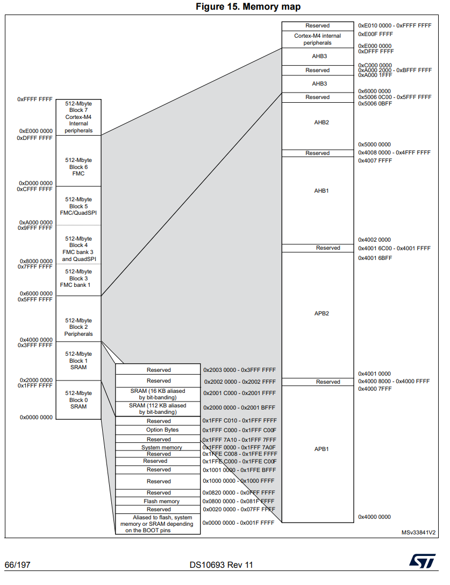

[정리짱잘한문서](https://puzzled-ravioli-c73.notion.site/Week2-Memory-Map-GPIO-3b7f34d5a40e8030ad25f0ff90d73031)

1. Block 0 (0x0000 0000 ~ 0x1FFF FFFF): Code Area

    주요 용도: 프로그램 코드 실행 및 부트(Boot) 영역
    주요 내부 구성:
    - 0x0000 0000: Boot 핀 설정에 따라 Flash, System Memory, SRAM 중 하나가 매핑되는 주소 공간입니다.
    - 0x0800 0000: 내장 Flash Memory 영역 (최대 512KB의 펌웨어 코드가 저장되는 공간)
    - 0x1FFF 0000: System Memory (ST에서 제공하는 ROM 부트로더 영역)
    - 0x1FFF C000: Option Bytes (사용자 설정 비트, 락비트 등)

2. Block 1 (0x2000 0000 ~ 0x3FFF FFFF): SRAM Area

    주요 용도: 내부 SRAM(데이터 메모리) 영역
    주요 내부 구성:
    - 0x2000 0000 ~ 0x2001 FFFF: 내장 SRAM (128KB, 변수·스택·힙 메모리로 사용)
    - 0x2200 0000 ~ 0x23FF FFFF: SRAM Bit-Band Alias 영역 (비트 단위 원자적 제어 가능)

3. Block 2 (0x4000 0000 ~ 0x5FFF FFFF): Peripherals Area

    주요 용도: Chip 내부 주요 하드웨어 주변장치(Peripherals) 레지스터
    주요 내부 구성:
    - 0x4000 0000 ~ 0x4000 7FFF: APB1 버스 주변장치 (TIM2~7, USART2~5, SPI2/3, I2C1~3, CAN1/2, DAC 등)
    - 0x4001 0000 ~ 0x4001 6BFF: APB2 버스 주변장치 (TIM1/8, USART1/6, SPI1/4, ADC1~3, EXTI 등)
    - 0x4002 0000 ~ 0x4007 FFFF: AHB1 버스 주변장치 (GPIOA~H, RCC, DMA1/2, Flash Interface 등)
    - 0x5000 0000 ~ 0x5006 0BFF: AHB2 버스 주변장치 (USB OTG FS, DCMI 등)
    - 0x4200 0000 ~ 0x43FF FFFF: Peripheral Bit-Band Alias 영역

4. Block 3 (0x6000 0000 ~ 0x7FFF FFFF): External RAM Area (FMC Bank 1)

    주요 용도: 외부 메모리 컨트롤러(FMC)를 통한 외부 정적 RAM 및 Flash 메모리 연결
    주요 내부 구성:
    - NOR Flash, PSRAM, SRAM 등의 외부 비휘발성/휘발성 메모리를 매핑하여 데이터 보관 및 코드 실행 공간으로 확장.

5. Block 4 (0x8000 0000 ~ 0x9FFF FFFF): External Device Area (FMC Bank 2/NAND/SDRAM)

    주요 용도: 외부 장치, NAND Flash, SDRAM 영역
    주요 내부 구성:
    - FMC를 통한 외부 NAND Flash 제어 및 SDRAM Bank 주소 매핑 영역.

6. Block 5 (0xA000 0000 ~ 0xBFFF FFFF): External Peripheral / FMC Register Area

    주요 용도: 외부 확장 인터페이스의 제어 레지스터 및 Quad-SPI 메인 메모리 영역
    주요 내부 구성:
    - 0xA000 0000: FMC 제어 레지스터 (FMC Control Registers)
    - 0xA000 1000: Quad-SPI 제어 레지스터 (QUADSPI Register)
    - Quad-SPI Flash 메모리 맵 매핑 영역

7. Block 6 (0xC000 0000 ~ 0xDFFF FFFF): External RAM / SDRAM Area

    주요 용도: 외부 SDRAM (FMC SDRAM Bank 1 / Bank 2) 영역
    주요 내부 구성:
    - 대용량 데이터 저장을 위해 외부 SDRAM을 FMC 인터페이스로 매핑할 때 기본으로 사용되는 영역입니다.

8. Block 7 (0xE000 0000 ~ 0xFFFF FFFF): Cortex-M4 Internal Peripherals Area

    주요 용도: ARM Cortex-M4 코어 내부 전용 레지스터 및 예약(Reserved) 공간
    주요 내부 구성:
    - 0xE000 0000 ~ 0xE00F FFFF: Cortex-M4 내부 주변장치
    - NVIC (Nested Vectored Interrupt Controller: 인터럽트 제어기)
    - SysTick Timer (시스템 타이머)
    - SCB (System Control Block)
    - MPU (Memory Protection Unit)
    - Debug 및 Trace 인터페이스 (ITM, DWT, FPB 등)
    - 0xE010 0000 ~ 0xFFFF FFFF: 예약 영역 (System Reserved)

### 버?스


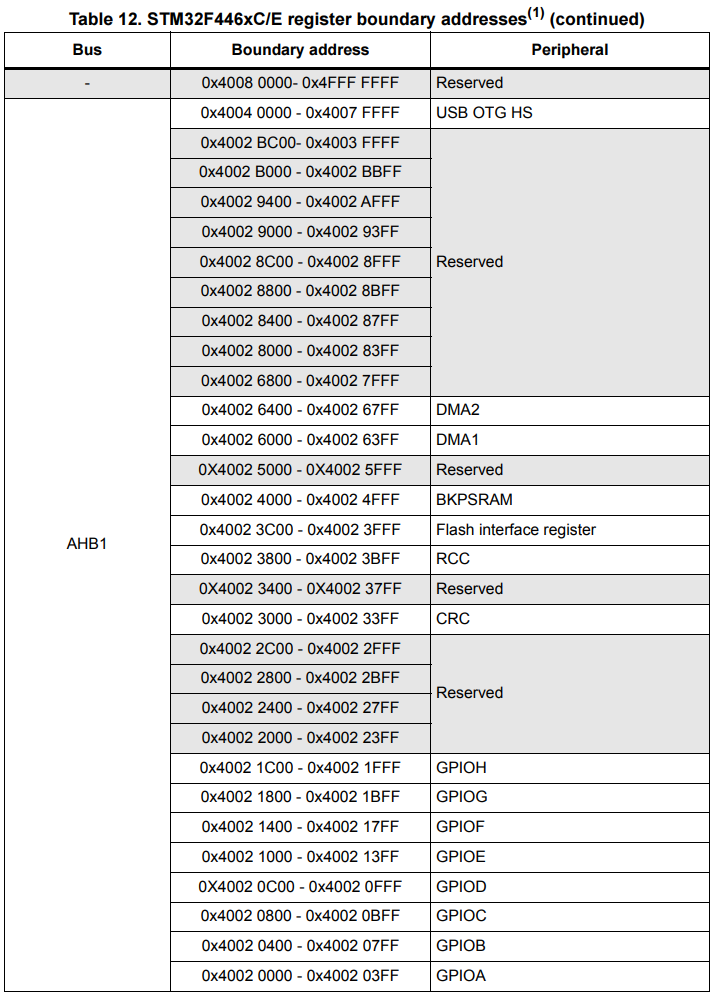

**Figure 3. STM32F446xC/E block diagram** 


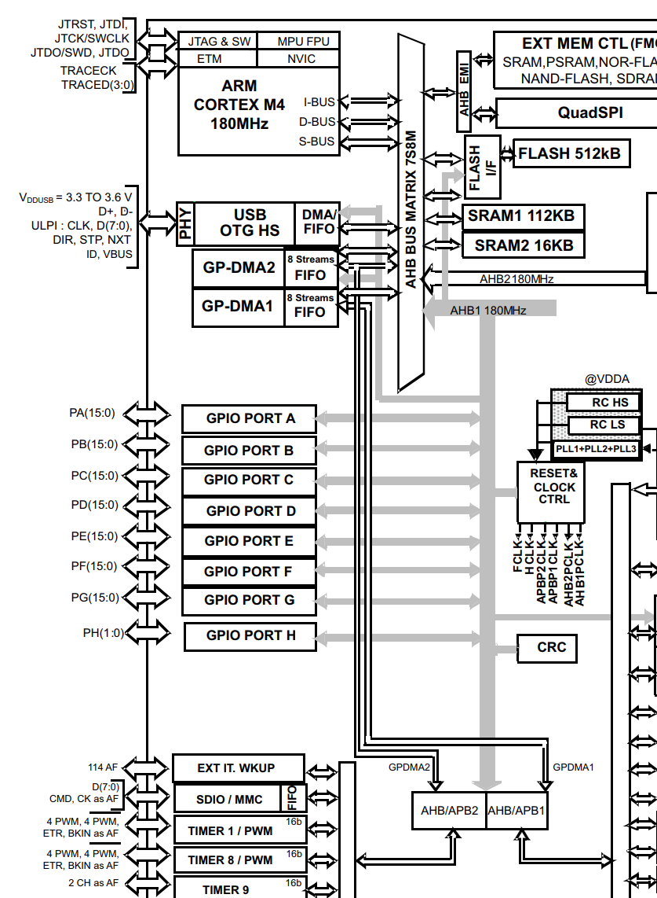
1. 버스
    1. AHB 1_3
        1. AHB
            *  고성능, 고속 시스템 모듈 연결에 사용되는 메인 내부 버스
            * 높은 데이터 전송 폭(32-bit 등)과 높은 클록 주파수(최대 시스템 시계)를 지원하여 빠른 데이터 처리가 필요한 핵심 부품들을 연결
        1. 
    1. APB 1_2
        1. APB
            * 저전력, 저속 주변장치를 제어하기 위해 최적화된 버스입니다.
            * 복잡한 파이프라인이나 높은 대역폭이 필요하지 않은 통신/제어용 주변장치들이 연결되며, AHB 버스에 AHB/APB Bridge(다리)를 거쳐 연결

### 버스 구조 및 스펙 비교

| 버스 이름 | 속도 / 성능 | 전력 소비 | 주요 연결 대상 | STM32 사용 여부 |
| :--- | :--- | :--- | :--- | :--- |
| **AHB** (High-performance) | 고속 (최대 클록) | 상대적으로 높음 | CPU 코어, RAM, Flash, DMA | 핵심 메인 버스로 사용 |
| **ASB** (System Bus) | 중/고속 | 보통 | 구형 ARM7/9 시스템 모듈 | 사용 안 함 (AHB로 대체됨) |
| **APB** (Peripheral) | 저속/중속 | 저전력 | 주요 주변장치: TIM2~TIM7, USART2/3, UART4/5, I2C, SPI2/3, DAC, CAN 등 | AHB-APB Bridge 연동 사용 |


| 버스 이름 | 최대 동작 주파수 | 주요 역할 및 핵심 장치 |
| :--- | :--- | :--- |
| **AHB1** | 180 MHz | GPIO 포트(A~H), DMA1/2, RCC, BKPSRAM, USB OTG HS |
| **AHB2** | 180 MHz | DCMI (카메라), USB OTG FS |
| **AHB3** | 180 MHz | FMC (외부 RAM/Flash), Quad-SPI |
| **APB1** | 45 MHz | 저속 타이머(TIM2~7, 12~14), USART2~5, SPI2/3, I2C1~3, CAN1/2, DAC |
| **APB2** | 90 MHz | 고급 타이머(TIM1, TIM8), USART1/6, SPI1/4, ADC1~3, SDIO, SYSCFG |

카메라, 외부 ram, 타이머(주변 기기 주기적인 입/출력) 쓸 거 아닌 이상 지금은 AHB1이면 충분하다.
***

### ODR, BSRR
STM32 등 ARM 마이크로컨트롤러에서 GPIO 핀을 제어할 때 사용하는 BSRR(Bit Set/Reset Register)과 ODR(Output Data Register)은 

출력 값을 바꾸는 방식과 처리 속도에서 차이가 납니다. ODR은 전체 비트를 한꺼번에 읽고 쓰는 방식이며, BSRR은 원하는 핀만 개별적으로 켜거나 끌 수 있는 전용 레지스터입니다.

#### ODR (Output Data Register) 방식

* **동작 방식:** 
    * 읽기-수정-쓰기(Read-Modify-Write) 과정을 거칩니다. 기존 포트 상태를 읽은 뒤, 원하는 핀의 값을 바꾼 후 다시 레지스터에 씁니다.
* **특징:**
    * 전체 핀의 상태를 한 번에 제어할 때 유용합니다.
    * 다른 핀의 상태를 유지하기 위해 추가 연산이 필요합니다.
    * 인터럽트가 발생할 경우 중간에 값이 바뀔 위험이 있어 원자적(Atomic)이지 않습니다.

#### BSRR (Bit Set/Reset Register) 방식

* **동작 방식:** 
    * 쓰기(Write) 한 번으로 끝납니다. 하위 16비트는 핀을 켜고(Set), 상위 16비트는 핀을 끕니다(Reset).
* **특징:**
    * 제어하려는 핀에만 직접 영향을 줍니다.
    * 읽기나 수정 과정이 없어 속도가 매우 빠릅니다.
    * 인터럽트 방해 없이 안전하게 핀 하나만 바꿀 수 있는 원자적 제어가 가능합니다.

| 구분 | ODR 방식 | BSRR 방식 |
| :--- | :--- | :--- |
| **처리 단계** | 읽기 → 수정 → 쓰기 (3단계) | 쓰기 (1단계) |
| **속도** | 상대적으로 느림 | 매우 빠름 |
| **안정성 (Atomic)** | 낮음 (인터럽트 충돌 가능) | 높음 (단일 사이클 쓰기) |

***

### GPIO
1. 총 8개 포트
1. 포트당 16개 핀
***

> 일단 이런게 있다는 정도만 알아두기

## description
[reference_manual] 174p

각 GPIO 핀은 소프트웨어를 통해 출력 모드(푸시풀 또는 오픈드레인 방식, 풀업 또는 풀다운 저항 사용 여부 선택 가능), 입력 모드(플로팅 상태, 풀업 또는 풀다운 저항 사용 여부 선택 가능) 또는 주변장치 대체 기능(Peripheral Alternate Function) 모드로 설정할 수 있습니다.

대부분의 GPIO 핀은 디지털 또는 아날로그 대체 기능과 공유되어 사용됩니다. 모든 GPIO는 고전류 출력이 가능(high-current-capable)하며, 내부 노이즈, 소비 전력 및 전자기 방출(EMI)을 효과적으로 관리할 수 있도록 동작 속도 선택 기능을 제공합니다.

입출력 레지스터에 의도치 않은 쓰기 동작(스퍼리어스 쓰기)이 발생하는 것을 방지하기 위해, 특정 시퀀스를 따라 필요시 I/O 제어 설정을 잠글(Lock) 수 있습니다.

또한, 고속 I/O 처리 성능을 지원하여 최대 90 MHz까지 I/O 신호 토글(Toggling)이 가능합니다.

각 GPIO 포트(Port A, Port B 등)는 16개의 핀(Pin 0 ~ 15)을 제어하기 위해 32비트 규격의 레지스터들을 갖추고 있습니다.

### GPIO 주요 특징 (GPIO Main Features)

- **포트 제어 범위**
  - 포트당 최대 16개의 I/O 핀 제어 가능 (Up to 16 I/Os under control)
- **출력 구성 (Output Configuration)**
  - 푸시풀(Push-Pull) 또는 오픈 드레인(Open-Drain) 모드 지원
  - 내부 풀업/풀다운(Pull-Up/Pull-Down) 저항 조합 가능
- **출력 데이터 경로 (Output Data Source)**
  - 출력 데이터 레지스터(`GPIOx_ODR`)를 통한 직접 출력
  - 주변장치의 대체 기능 출력(Alternate Function Output)을 통한 출력
- **I/O 속도 설정 (Speed Selection)**
  - 각 I/O 핀별 독립적인 출력 동작 속도 선택 가능
- **입력 구성 (Input Configuration)**
  - 플로팅(Floating), 내부 풀업/풀다운(Pull-Up/Pull-Down), 아날로그(Analog) 모드 지원
- **입력 데이터 경로 (Input Data Destination)**
  - 입력 데이터 레지스터(`GPIOx_IDR`)로 읽어오기
  - 주변장치의 대체 기능 입력(Alternate Function Input)으로 전달
- **원자적 비트 제어 (Atomic Bit Access)**
  - 비트 세트/리셋 레지스터(`GPIOx_BSRR`)를 통해 `GPIOx_ODR`의 특정 비트만 안전하게 Write 가능
- **잠금 기능 (Locking Mechanism)**
  - 잠금 레지스터(`GPIOx_LCKR`)를 사용하여 설정된 I/O 구성을 동결(Freeze) 처리
- **아날로그 기능 (Analog Function)**
  - ADC/DAC 연동을 위한 아날로그 입출력 지원
- **대체 기능 선택 (Alternate Functions)**
  - I/O당 최대 16개의 AF(Alternate Function, AF0~AF15) 선택 레지스터 제공
- **고속 토글 (Fast Toggle)**
  - 매 2 클록 주기(Clock Cycles)마다 핀 상태 반전 가능
- **핀 멀티플렉싱 (Pin Multiplexing)**
  - I/O 핀을 일반 GPIO 또는 다양한 주변장치 기능으로 유연하게 전환 및 할당 가능

## registers

1. 설정 레지스터 (Configuration Registers - 4개)
    1. **GPIOx_MODER (Port Mode Register)**
        * 핀의 기본 동작 모드(입력, 출력, 대체 기능, 아날로그)를 설정합니다.
        * 핀 하나당 2비트씩 할당되어 16개 핀($16 \times 2 = 32\text{비트}$)을 제어합니다.
        * 설정 값:
            * 00: Input Mode (입력 모드) - 버튼이나 센서 등 외부 신호를 읽어올 때 사용 
            * 01: General Purpose Output Mode (일반 출력 모드) - LED, 리레이 등 외부 디바이스를 제어할 때 사용 
            * 10: Alternate Function Mode (대체 기능 모드) - UART, SPI, I2C, PWM 등 내부 페리페럴(주변장치)과 핀을 연결할 때 사용 
            * 11: Analog Mode (아날로그 모드) - ADC 입력 또는 DAC 출력으로 사용할 때 사용 (디지털 버퍼 OFF)

    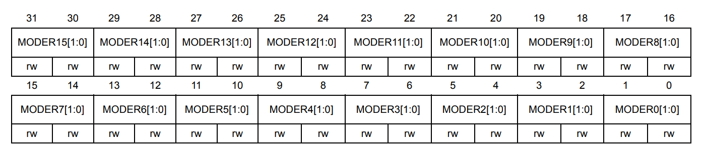

    2. **GPIOx_OTYPER (Output Type Register)**
        * 출력 모드일 때 동작 방식(Push-Pull 또는 Open-Drain)을 선택합니다.
        * 핀 하나당 1비트씩 사용합니다.
        * 32 비?트 => 
            * 상위 16비트는 Reserved 예약 공간. must be kept at reset value
            * 하위 16비트로 Pin 0~15 제어
        * 설정 값:
            * 0: Push-Pull (푸시풀 출력) - $V_{DD}$(3.3V)와 GND(0V) 전압을 강력하게 밀고 당겨 바로 출력. 일반적인 디지털 출력에 사용됩니다. (reset state)
            * 1: Open-Drain (오픈드레인 출력) - Low(0V) 신호만 직접 끌어내리고 High(1) 신호는 Floating 상태가 됨. $I^2C$ 통신 버스나 외부 풀업 저항을 연결한 레벨 시프팅에 사용됩니다.
    
    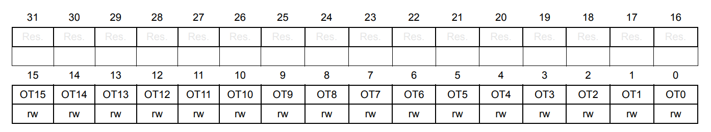

    3. **GPIOx_OSPEEDR (Output Speed Register)**
        * 출력 신호의 스위칭 속도(Low, Medium, Fast, High)를 설정하여 노이즈와 전력 소모를 제어합니다.
        * == 전압이 올라가고 내려가는 슬루 레이트(Slew Rate) 및 구동 속도를 지정합니다.
        * 입출력 방향(I/O direction)에 관계없이 해당 핀의 레지스터 비트에 직접 연결되어 작동합니다.
        * 핀당 2비트 할당 (16개 핀 $\times$ 2비트 = 32비트) 
        * 설정 값:
            * 00: Low Speed (저속)
            * 01: Medium Speed (중속)
            * 10: Fast Speed (고속)
            * 11: High Speed (초고속)
        * 주의 사항: 속도를 필요 이상으로 높게 설정하면 전력 소모가 늘어나고 신호 노이즈(EMI)가 증가하므로, SPI/SDIO 같은 고속 통신 핀이 아니라면 알맞은 속도로 설정하는 것이 좋습니다.
    
    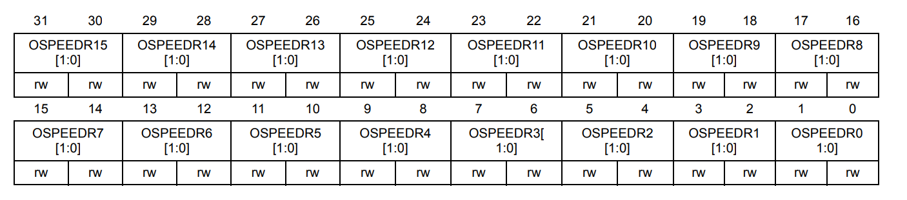

    4. **GPIOx_PUPDR (Pull-up/Pull-down Register)**
        * 핀 내부의 Pull-Up 저항, Pull-Down 저항 사용 여부 또는 No Pull 상태를 지정합니다.
        * 입력 모드 뿐만 아니라 입출력 방향(I/O direction)에 관계없이 동작합니다 (예: Open-Drain 출력 시 내부 풀업 적용 등).
        * 설정 값:
            * 00: No Pull-Up / No Pull-Down (내부 저항 사용 안 함, Floating) 
            * 01: Pull-Up (내부 $V_{DD}$ 방면 풀업 저항 활성화) - 기본 상태를 High로 유지 
            * 10: Pull-Down (내부 GND 방면 풀다운 저항 활성화) - 기본 상태를 Low로 유지 
            * 11: Reserved (사용하지 않음)

    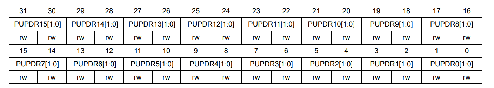

2. 데이터 레지스터 (Data Registers - 2개)
    1. **GPIOx_IDR (Input Data Register)**
        * 외부에서 입력된 핀의 현재 논리 상태(0 또는 1)를 읽어오는 읽기 전용(Read-Only) 레지스터입니다.
        * 32비트 메모리 맵 레지스터 중 
            * 하위 16비트(Bit 0 ~ Bit 15)가 사용되며, 각 비트는 해당 포트의 Pin 0 ~ Pin 15의 논리 상태와 1:1로 매핑됩니다.
            * 상위 16비트(Bit 16 ~ Bit 31)는 사용하지 않는 예약(Reserved) 공간입니다. must be kept at reset value
        * Read-Only (읽기 전용): 소프트웨어에서 이 레지스터에 값을 쓸 수 없으며, 오직 읽기만 가능합니다.
        * 외부 핀에 걸린 전압(High/Low)은 슈미트 트리거(Schmitt Trigger)를 거쳐 매 클록 주기(AHB1 clock cycle)마다 GPIOx_IDR 레지스터로 자동 샘플링되어 업데이트됩니다.
        * 코드에서 GPIOx_IDR 레지스터의 특정 비트를 읽으면 해당 핀의 현재 논리 상태(1: High, 0: Low)를 확인할 수 있습니다.

    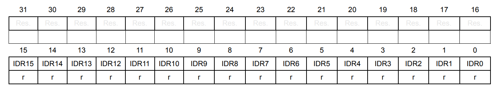

    2. **GPIOx_ODR (Output Data Register)**
        * 핀으로 출력할 데이터(0 또는 1)를 저장하고 제어하는 읽기/쓰기(Read/Write) 레지스터입니다.
        * 32비트 메모리 맵 레지스터 중
            * 하위 16비트(Bit 0 ~ Bit 15)가 사용되며, 각 비트는 해당 포트의 Pin 0 ~ Pin 15의 출력 상태를 결정합니다.
            * 상위 16비트(Bit 16 ~ Bit 31)는 예약(Reserved) 공간입니다. must be kept at reset value
        * Read/Write (읽기 및 쓰기 모두 가능) : 소프트웨어에서 값을 직접 적어 출력 상태를 바꾸거나, 현재 설정되어 있는 출력 데이터 값을 읽어올 수 있습니다.
        * 해당 비트에 1을 쓰면 핀의 출력이 High(Push-Pull 시 $V_{DD}$ 3.3V)가 되고, 0을 쓰면 Low(GND 0V)가 됩니다.
        * 주의점: ODR에 직접 값을 쓸 때(Read-Modify-Write 연산) 다른 핀의 상태가 함께 변경되거나 인터럽트가 개입하면 데이터 오염 위험이 있어, 실무나 베어메탈 개발에서는 비트 단위 원자적(Atomic) 조작이 가능한 GPIOx_BSRR (Bit Set/Reset Register) 레지스터를 통해 ODR 값을 제어하는 방식을 자주 활용합니다.

    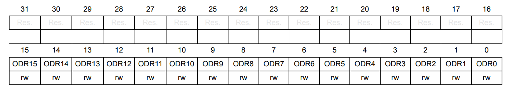

3. 세트/리셋 레지스터 (Set/Reset Register - 1개) : I/O Data Bitwise Handling
    1. **GPIOx_BSRR (Bit Set/Reset Register)** 
        * GPIOx_ODR대신 GPIOx_BSRR를 사용하면 단 한 번의 쓰기 동작(Single Atomic Access)만으로 원하는 비트만 원자적으로(Atomic) 변경할 수 있습니다.
        * GPIOx_ODR 레지스터의 특정 비트만 안전하게 1(Set) 또는 0(Reset)으로 바꿀 때 사용합니다.
        * 32비트 레지스터
            * GPIOx_ODR은 16비트 레지스터(Pin 0 ~ Pin 15)인 반면, GPIOx_BSRR은 32비트 레지스터로 ODR의 두 배 크기를 가집니다.
            * 하위 16비트 (BS0 ~ BS15, Bit $i$): Bit Set (High 출력)
                * 해당 비트에 1을 적으면 ODR(i) 비트가 1(High)이 됩니다.(해당 핀을 1(High)로 세트합니다.)
            * 상위 16비트 (BR0 ~ BR15, Bit $i+16$): Bit Reset (Low 출력)
                * 해당 비트에 0을 적으면 ODR(i) 비트가 0(Low)이 됩니다.(해당 핀을 0(Low)으로 리셋합니다.)
            * 0을 쓰는 경우 (No Effect):
                * GPIOx_BSRR의 어떤 비트에 0을 적더라도 GPIOx_ODR의 기존 상태에는 아무런 영향(노변화)을 주지 않습니다.
        * 동시 Set/Reset 시 우선순위 (Priority)
            * 동일한 핀에 대해 Set 비트와 Reset 비트를 동시에 1로 쓰려고 시도하면 Set(1로 만들기) 동작이 우선 적용됩니다
        * 다른 핀의 값에 영향을 주지 않고 원자적(Atomic)으로 조작할 수 있습니다.

    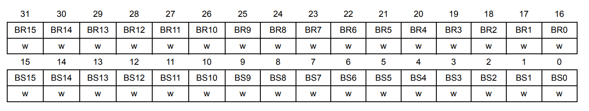

4. 잠금 레지스터 (Locking Register - 1개)
    * GPIO Locking Mechanism은 특정 GPIO 핀의 설정을 동결(Freeze)하여, 칩이 리셋되기 전까지 더 이상 제어 레지스터의 값이 변경되지 않도록 보호하는 기능입니다.

    * 소프트웨어 버그나 외부 노이즈로 인해 입출력 설정이 오작동으로 변경되는 것을 방지하기 위해 사용하며, 한번 잠금(Lock) 상태가 되면 MCU를 리셋(Reset)하기 전까지는 절대로 잠금을 해제할 수 없습니다.
    1. **GPIOx_LCKR (Port Configuration Lock Register)**
        * 지정된 시퀀스를 통해 레지스터 설정을 고정(Lock)하여, 프로그램 실행 중 오작동으로 인한 핀 설정 변경을 방지합니다.
        * 동결(Freeze)되는 제어 레지스터 대상
            * GPIOx_LCKR 레지스터를 통해 특정 핀의 Lock을 활성화하면, 해당 핀과 관련된 모든 32비트 제어 레지스터 설정이 잠금 처리됩니다.
            * GPIOx_MODER (입/출력/AF/Analog 모드 설정)
            * GPIOx_OTYPER (Push-Pull / Open-Drain 설정)
            * GPIOx_OSPEEDR (출력 속도 설정)
            * GPIOx_PUPDR (Pull-Up / Pull-Down 설정)
            * GPIOx_AFRL & GPIOx_AFRH (대체 기능 Select 레지스터)
        * GPIOx_LCKR은 32비트 레지스터입니다.
            * LCK[15:0] (Bit 15 ~ Bit 0): 포트 내 Pin 0 ~ Pin 15에 각각 대응되는 비트입니다.
                * 0: 해당 핀의 설정을 잠그지 않음 (Unlocked)
                * 1: 해당 핀의 설정을 잠금 (Locked)
            * LCKK (Bit 16): Lock Key 비트. 특정 시퀀스를 통해 잠금 상태를 활성화/확인하는 비트입니다.
        * 32-bit Word Access 필수: 
            * 아무런 의도치 않은 쓰기 작업으로 실수로 핀이 잠기는 것을 방지하기 위해, ST사 MCU는 엄격한 32비트 워드(Word) 쓰기/읽기 시퀀스를 요구합니다.
            * LCKK(Bit 16)와 LCK[15:0](Bit 15~0)을 동시에 제어해야 하므로 반드시 32비트 단편(Word) 단위로 접근해야 합니다. (8비트/16비트 접근 불가)
        * LCK[15:0] 값 유지: 시퀀스를 수행하는 도중 LCK[15:0] 비트 패턴(잠그고자 하는 핀 선택 값)은 항상 동일해야 합니다.

    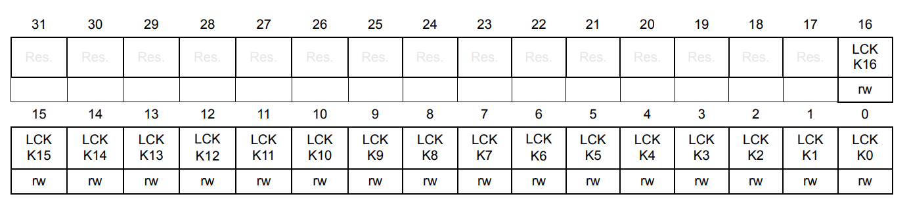

5. 대체 기능 선택 레지스터 (Alternate Function Registers - 2개)
    > MCU(마이크로컨트롤러)의 물리적인 핀 개수는 제한되어 있지만, 내부에는 수많은 기능(UART 통신, SPI 통신, 타이머 PWM 출력 등)이 존재합니다. </br>이 문제를 해결하기 위해 하나의 핀을 여러 용도로 돌려쓸 수 있도록 만드는 스위치가 내부에 들어있는데, 이 스위치가 바로 멀티플렉서(Multiplexer, MUX)입니다.

    * Alternate Function(대체 기능)은 하나의 물리적 GPIO 핀을 단순 일반 입출력(GPIO) 외에도 외부 통신이나 주변장치의 입출력 핀으로 재활용(다중화)하여 사용할 수 있게 해주는 기능입니다.
    * 각 I/O 핀에 대해 사용할 수 있는 16개의 대체 기능(Alternate Function) 입/출력 중 하나를 선택하기 위해 2개의 레지스터가 제공됩니다. 이 레지스터들을 통해 애플리케이션 요구사항에 맞춰 특정 대체 기능을 다른 핀에 연결할 수 있습니다.
    * 이는 GPIOx_AFRL 및 GPIOx_AFRH 대체 기능 레지스터를 사용하여 각 GPIO 핀에 여러 주변장치(Peripheral) 기능이 멀티플렉싱(Multiplexing)되어 있음을 의미합니다. 이를 통해 애플리케이션은 각 I/O 핀에 대해 가용한 기능 중 하나를 선택할 수 있습니다.
    * AF 선택 신호는 대체 기능 입력과 대체 기능 출력에 공통으로 적용되므로, 단일 I/O의 대체 기능 입력/출력을 위해 하나의 채널(AF0~AF15 중 하나)만 선택됩니다.
    * 애플리케이션은 한 번에(at a time) 각 I/O 핀당 하나의 주변장치 기능만 선택할 수 있습니다.
    * 각 GPIO 핀에 어떤 주변장치 기능들이 멀티플렉싱되어 있는지 확인하려면 데이터시트(Datasheet)를 참조하십시오.
    1. **GPIOx_AFRL & GPIOx_AFRH (Alternate Function Low / High Register)**
        * 핀을 UART, SPI, I2C, PWM 타이머 등 내부 주변장치의 통신 핀으로 재매핑할 때 사용합니다.
        * 32비트 레지스터 2개로 나누어 제어합니다. (32bit*2register)
            * 16개의 AF 기능(AF0 ~ AF15) 중 하나를 선택해야 하므로, 핀 하나당 4비트의 설정값(AF0 ~ AF15)이 필요합니다.
            * AFRL: Pin 0 ~ Pin 7 (하위 8개 핀) AF 기능을 설정
            * AFRH: Pin 8 ~ Pin 15 (상위 8개 핀) AF 기능을 설정
        
    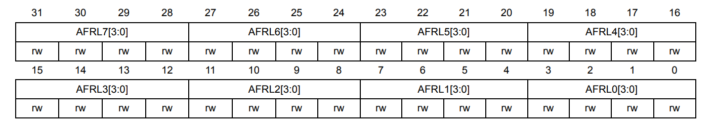

    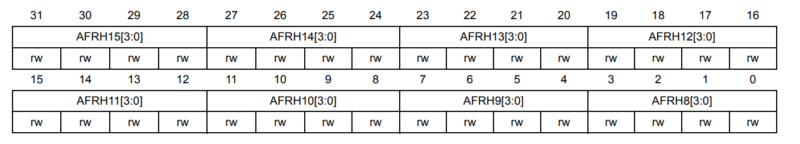

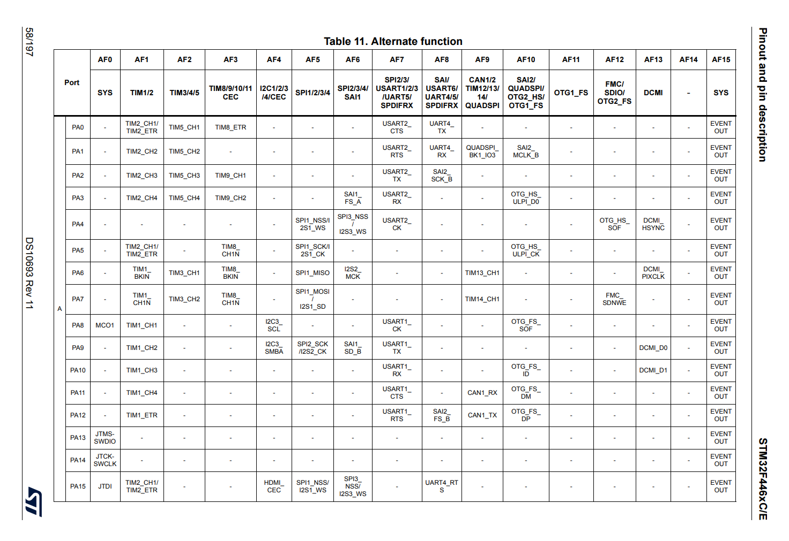
[datasheet58p~65p]
1. PA9 핀의 AF7번 기능이 USART1_TX에 할당되어 있다고 써 있습니다.
1. PA9번 핀이므로 GPIOA_AFRH 레지스터를 변경해야 합니다(Pin 8~15 제어).
1. GPIOA_AFRH에서 PA9에 해당하는 4비트 위치에 7 (이진수 0111)을 적어 넣습니다.
1. 내부 멀티플렉서 스위치가 AF7 레인으로 틱-하고 전환되면서, PA9 핀이 CPU의 GPIO 제어기에서 떨어져 나가 USART1 모듈과 직렬 연결됩니다.
```c
// PA9 핀의 대체 기능을 AF7(USART1_TX)로 설정하는 코드 예시

// 1. PA9 핀에 해당하는 비트 위치를 깨끗이 비움 (Clear)
GPIOA->AFR[1] &= ~(0xF << ((9 - 8) * 4)); 

// 2. PA9 핀 위치에 값 7 (AF7 = USART1)을 덮어씀 (Set)
GPIOA->AFR[1] |=  (7 << ((9 - 8) * 4));

//////////////////////////////////////////////

//STM32 HAL 드라이버
GPIO_InitTypeDef GPIO_InitStruct = {0};

GPIO_InitStruct.Pin       = GPIO_PIN_9;
GPIO_InitStruct.Mode      = GPIO_MODE_AF_PP;  // 대체 기능 밀어-당김(Alternate Function)
GPIO_InitStruct.Alternate = GPIO_AF7_USART1; // AF7 (USART1) 선택!
HAL_GPIO_Init(GPIOA, &GPIO_InitStruct);
```


포트 1개당 레지스터: 총 10개의 32비트 레지스터 존재

포트의 10개 레지스터들이 16개 핀을 제어한다.

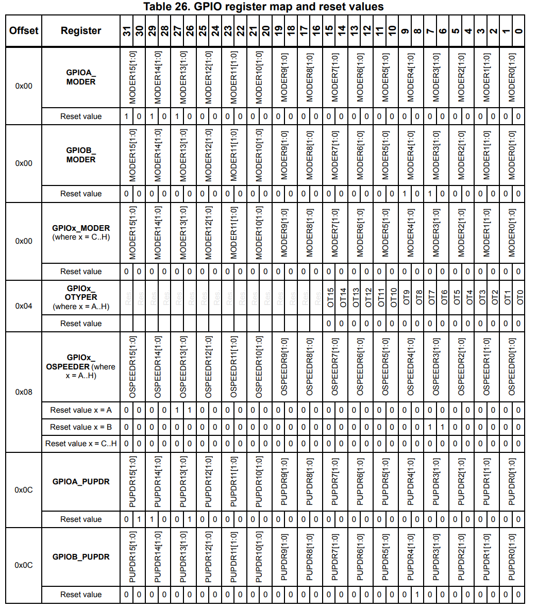

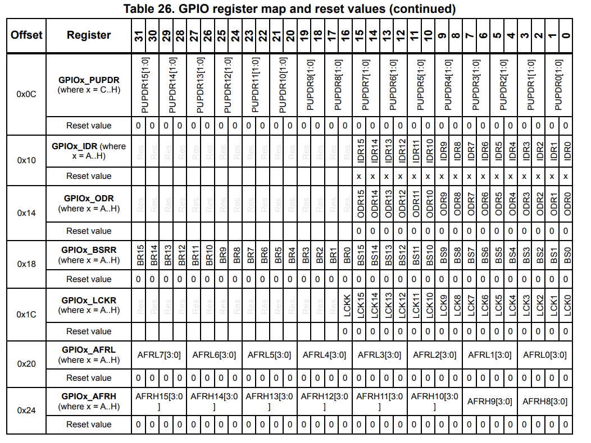


***
## 오늘 할 거
[참고하면좋은wiki.docs](https://wiki.st.com/stm32mcu/wiki/Getting_started_with_GPIO)

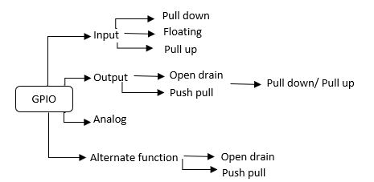

## Input mode
외부 회로의 전압 상태(High/Low)를 읽어들여 칩 내부 레지스터(GPIOx_IDR)에 digital 데이터(1 또는 0)로 저장하는 모드입니다.

**no pull-up and no pull-down or pull-up or pull-down**

1. Pull-Up Input (풀업 입력)
    * 내부의 약한 Pull-Up 저항(보통 $V_{DD}$ 공급)을 활성화합니다.
    * 입력이 없을 때 기본적으로 High(1) 상태를 유지하며, 스위치를 누르면 GND와 연결되어 Low(0)가 되는 구조(Active Low)에 주로 사용됩니다.

1. Pull-Down Input (풀다운 입력)
    * 내부의 약한 Pull-Down 저항(GND 연결)을 활성화합니다.
    * 입력이 없을 때 기본적으로 Low(0) 상태를 유지하며, 스위치를 누르면 $V_{DD}$와 연결되어 High(1)가 되는 구조(Active High)에 주로 사용됩니다.

1. Floating Input (플로팅 입력)
    * 내부 풀업/풀다운 저항을 모두 비활성화합니다.
    * 플로팅(Floating) 입력은 전자회로에서 입력 핀이 전원(HIGH)이나 접지(LOW) 어디에도 연결되지 않아 전압 상태가 불안정하게 떠 있는 현상입니다. 이 상태에서는 주변 노이즈나 정전기 때문에 입력 값이 0과 1 사이를 무작위로 오가며 오작동을 일으킵니다.
    * 외부에서 강제로 High/Low 전압을 확실하게 공급해 주는 회로(예: 외부 저항 회로, 다른 IC의 출력 pin)에 연결할 때 사용합니다.

> Input configuration (입력 설정)  
I/O 포트가 입력(Input)으로 프로그래밍되었을 때:
1. Output buffer is disabled : 출력 버퍼가 비활성화됩니다.
    * 설명: 핀이 입력 모드일 때는 MCU 내부에서 핀으로 전압을 내보내는 P-MOS/N-MOS 드라이버(출력 버퍼)를 차단하여 High-Z(고임피던스) 상태로 만듭니다.
    * 이유: 외부 회로에서 들어오는 신호와 MCU 내부 출력 신호가 충돌(Short)하여 칩이 손상되는 것을 방지하기 위함입니다.
1. The Schmitt trigger input is activated : 슈미트 트리거(Schmitt trigger) 입력이 활성화됩니다.
    * 설명: 외부 핀의 아날로그적인 전압 신호를 명확한 디지털 신호(0 또는 1)로 변환해 주는 하드웨어 회로입니다.
    * 역할: 히스테리시스(Hysteresis) 특성을 갖고 있어 신호에 포함된 미세한 노이즈나 바운싱 현상으로 인해 디지털 값이 0과 1 사이에서 불안정하게 흔들리는 것(Chattering)을 방지하고 깔끔한 High/Low 신호로 정형해 줍니다. (단, Analog 모드 설정 시에는 이 슈미트 트리거도 꺼져서 전력 소모를 줄입니다.)
1. The pull-up and pull-down resistors are activated depending on the value in the GPIOx_PUPDR register : GPIOx_PUPDR 레지스터의 설정값에 따라 풀업(Pull-up) 및 풀다운(Pull-down) 저항이 활성화됩니다.
    * 설명: GPIOx_PUPDR 레지스터의 설정에 따라 핀 내부에 연결된 약 30kΩ~50kΩ의 풀업 또는 풀다운 저항을 연결할 수 있습니다.
    * 역할: 외부 입력이 아무것도 연결되지 않거나 버튼이 떼어진 플로팅(Floating) 상태일 때, 전압이 붕 떠서 노이즈를 타는 것을 방지하여 기본 입력 상태를 High(VDD) 또는 Low(GND)로 고정해 줍니다.
1. The data present on the I/O pin are sampled into the input data register every AHB1 clock cycle : I/O 핀에 존재하는 데이터는 매 AHB1 클록 주기마다 입력 데이터 레지스터(GPIOx_IDR)로 샘플링됩니다.
    * 설명: 핀을 통과해 슈미트 트리거를 거친 디지털 값은 MCU의 메인 버스 중 하나인 AHB1 버스 클록 스피드(최대 180MHz 등)에 맞춰 계속해서 입력 데이터 레지스터(GPIOx_IDR) 갱신에 동기화됩니다.
    * 의미: 사용자가 레지스터를 읽는 시점 직전의 실제 핀 상태가 항상 최신 상태로 유지됨을 의미합니다.
1. A read access to the input data register provides the I/O State : 입력 데이터 레지스터를 읽기(Read) 접근하면 현재 I/O 핀의 상태(High/Low)를 얻을 수 있습니다.
    * 설명: C언어 코드(예: HAL_GPIO_ReadPin() 또는 GPIOA->IDR)를 통해 GPIOx_IDR 레지스터를 읽으면 해당 핀이 현재 논리 1(High, 3.3V)인지 논리 0(Low, 0V)인지를 반환받게 됩니다.

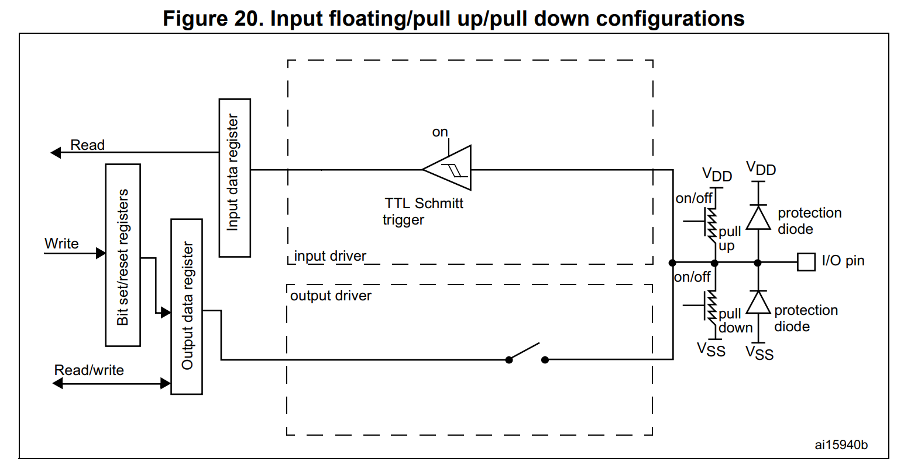
* I/O pin (오른쪽 핀): 보드 외부에서 스위치, 센서 등이 연결되는 물리적인 핀입니다.
* Protection Diode (보호 다이오드): $V_{DD}$(3.3V)보다 높거나 $V_{SS}$(GND, 0V)보다 낮은 이상 과전압이 들어올 때 칩이 파손되지 않도록 방지해 줍니다.
* Pull-up / Pull-down 저항: 핀 내부 스위치(on/off)로 풀업 저항($V_{DD}$ 연결)이나 풀다운 저항($V_{SS}$ 연결)을 켜고 끌 수 있습니다.
* TTL Schmitt trigger (슈미트 트리거): 입력 신호의 노이즈를 제거하고 깔끔한 디지털 신호(0 또는 1)로 만들어 줍니다. (위쪽에 on 표시로 입력 모드 시 활성화됨을 보여줍니다)
* Output driver 스위치 (하단): 입력 모드일 때는 하단의 스위치가 열려(Open) 있어서 출력 기능이 차단(Disabled)됩니다.
* Input data register ($GPIOx\_IDR$): 슈미트 트리거를 통과한 디지털 신호가 최종적으로 저장되는 레지스터입니다. CPU가 Read 명령을 내려 이 값을 읽어옵니다.
#### 예시 A. Pull-Up(풀업) 모드 설정 시
1. 버튼을 안 눌렀을 때 (Open):
    1. 외부 핀이 아무 데도 안 닿아 있지만, 내부 풀업 저항에 의해 전압이 $V_{DD}$(3.3V)로 꽉 잡힙니다.
    1. 신호 흐름: I/O Pin ($3.3V$) $\rightarrow$ 슈미트 트리거 통과 $\rightarrow$ Input Data Register에 1 저장.
1. 버튼을 눌렀을 때 (Closed):
    1. 전류가 GND($V_{SS}$)로 빠져나가면서 핀 전압이 0V가 됩니다.
    1. 신호 흐름: I/O Pin ($0V$) $\rightarrow$ 슈미트 트리거 통과 $\rightarrow$ Input Data Register에 0 저장.
1. 결과: 안 누르면 1, 누르면 0이 읽힙니다 (Active Low 방식).


## Output mode
내부 레지스터(GPIOx_ODR 또는 GPIOx_BSRR)에 쓴 값(1 또는 0)에 따라 외부 핀으로 전압을 출력하는 모드입니다.  

1. Push-Pull (푸시풀 출력)
    * 구조: 내부 P-MOS와 N-MOS 트랜지스터 2개를 모두 활용합니다.  
    * 동작:
        * High(1) 출력 시: P-MOS 온 $\rightarrow$ $V_{DD}$ 전압(예: 3.3V)을 에너지를 담아 밀어냄(Push).
        * Low(0) 출력 시: N-MOS 온 $\rightarrow$ GND로 전류를 빨아들임(Pull).
        * 특징: 
            * 외부 풀업 저항 없이도 0V와 3.3V를 확실하게 출력할 수 있어 가장 흔히 사용됩니다 (예: LED 제어, 일반 디지털 신호 출력).
            * 속도가 빠르고 효율이 좋아 일반적인 GPIO 출력에 가장 많이 쓰입니다.
            * 여러 개 아웃풋을 선 하나로 묶으면 과전류로 장치가 망가질 수 있어 라인 공유가 불가능합니다.
1. Open-Drain (오픈드레인 출력)
    * 구조: P-MOS를 끄고 N-MOS 트랜지스터만 사용합니다.  
    * 동작:
        * Low(0) 출력 시: N-MOS 온 $\rightarrow$ 핀을 GND로 강하게 끌어내림.  
        * High(1) 출력 시: N-MOS 오프 $\rightarrow$ 핀이 Floating(Hi-Z) 상태가 됨 (스스로 High를 밀어내지 못함).
        * 특징: 
            * 여러 장치가 선 하나를 공유해도 안전하며(Wired-AND), I2C 같은 통신에 적합합니다. 3.3V 마이크로컨트롤러로 5V 장치를 제어하는 등 전압 레벨을 맞출 때 유연합니다.
            * High 상태 출력을 위해서는 외부 Pull-Up 저항이 필수적입니다.
        * 용도:
            * 여러 디바이스의 출력이 하나의 선에 연결되는 버스 통신(예: $I^2C$ 통신)에서 쇼트(Short) 방지.
            * 3.3V MCU로 5V 동작 디바이스를 제어할 때 Level Shifting 용도.

<br><br>
 
 오픈 드레인의 진짜 가치는 '스스로 High를 만드는 것'이 아니라, 'High를 만드는 주도권을 외부 회로에 넘겨주는 것'
 1. 전압이 서로 다른 부품끼리 안전하게 대화할 수 있습니다 (Level Shifting)
    * 3.3V로 작동하는 스마트폰 칩이 5V로 작동하는 디스플레이에 데이터를 보낸다고 가정
    * 푸시풀로 연결하면: 
        > 스마트폰이 High를 보낼 때 최대 3.3V 전압만 나옵니다. 5V 디스플레이 입장에서는 3.3V가 'High'인지 'Low'인지 애매해서 오작동이 일어날 수 있습니다. 반대로 디스플레이가 5V를 밀어내면 3.3V 칩이 과전압으로 타버릴 수도 있습니다.
    * 오픈 드레인으로 연결하면: 
        > 스마트폰 칩은 High일 때 손을 떼고 플로팅(오프) 상태가 됩니다. 이때 5V 전원과 풀업 저항을 선에 달아두면, 스마트폰이 손을 떼자마자 선의 전압이 자연스럽게 5V로 올라갑니다. 3.3V 칩에 무리를 주지 않고도 안전하게 5V 신호를 만들어낼 수 있는 것입니다.
1. 출력선 여러 개를 한 선에 그냥 묶어도 합선되지 않습니다 (Wired-AND)
    * 푸시풀로 연결하면:
        >  A 칩은 High(5V)를 출력하고, B 칩은 Low(0V)를 출력하는 순간, 5V 전원과 접지가 그대로 쇼트(합선)되어 과전류로 칩이 타버립니다.
    * 오픈 드레인으로 연결하면: 
        > A 칩이 High(플로팅), B 칩이 Low(0V)를 출력하면, 쇼트가 나지 않고 그냥 선 전체가 Low(0V)가 됩니다. 여러 칩이 동시에 손을 놓고 플로팅 상태가 되어야만 풀업 저항에 의해 선 전체가 High가 됩니다. 덕분에 칩이 망가질 걱정 없이 출력선 수십 개를 그냥 한 가닥으로 묶어서 통신할 수 있습니다.
1. 고전압·대전류 부품을 직접 온/오프할 수 있습니다
    * 마이크로컨트롤러(MCU) 내부의 아주 미세하고 연약한 회로는 12V나 24V 같은 높은 전압을 직접 견디지 못합니다.
    * 오픈 드레인 아웃풋은 Low일 때 접지(0V)를 제공하고, High일 때는 내부 전원과 완전히 분리(플로팅)됩니다.
    * 이를 이용해 출력 핀에 12V짜리 모터나 모터 구동용 모스펫(MOSFET)의 게이트를 직접 연결할 수 있습니다. 핀이 플로팅 상태가 되면 외부의 12V 전원이 가해져 모터가 켜지고, 핀이 Low가 되면 접지로 전류가 빠져나가 모터가 꺼집니다. 칩 내부 회로는 외부의 높은 전압으로부터 완전히 보호됩니다.

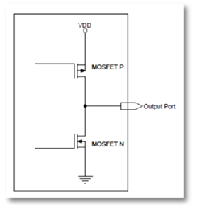 < pushpull

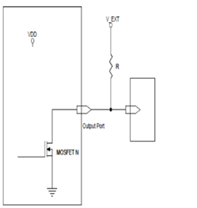 < opendrain


> Output configuration (출력 설정)  
I/O 포트가 출력(Output)으로 프로그래밍되었을 때:

1. 출력 버퍼 활성화 (The output buffer is enabled)
    * 핀이 출력 모드로 설정되면 MCU 내부의 출력 드라이버 회로(P-MOS / N-MOS 트랜지스터)가 활성화되어 외부 핀으로 전압/전류를 보낼 수 있게 됩니다. 출력 방식은 두 가지 모드로 동작합니다
    1. 오픈 드레인 모드 (Open Drain Mode)
        * 구조 및 동작: 상단의 P-MOS 트랜지스터는 전혀 사용하지 않고 하단의 N-MOS 트랜지스터만 동작시킵니다.  
        * 출력 0일 때: N-MOS가 ON이 되어 핀을 GND(0V)로 강하게 끌어내립니다 (Low).  
        * 출력 1일 때: N-MOS가 OFF가 되어 핀이 공중에 떠 있는 Hi-Z (High-Impedance, 고임피던스) 상태가 됩니다. 스스로 3.3V나 High 전압을 내보내지 못합니다.  
        * 특징/용도: High 전압 출력을 위해 외부 풀업 저항이 필수적입니다. $I^2C$ 통신 버스처럼 여러 장치가 단일 선을 공유하여 신호 충돌(Short)을 방지해야 할 때나, 다른 전압 수준(예: 5V)으로 Level Shifting이 필요할 때 사용됩니다.
    1. 푸시풀 모드 (Push-Pull Mode)
        * 구조 및 동작: P-MOS와 N-MOS 두 트랜지스터를 모두 사용합니다.  
        * 출력 0일 때: P-MOS OFF / N-MOS ON $\rightarrow$ 핀을 GND(0V)로 연결하여 전류를 빨아들입니다(Pull).  
        * 출력 1일 때: P-MOS ON / N-MOS OFF $\rightarrow$ 핀을 $V_{DD}$(3.3V)로 연결하여 전류를 밖으로 밀어냅니다(Push).  
        * 특징/용도: 외부 풀업 저항 없이도 0V와 3.3V를 강력하고 확실하게 출력하므로 일반적인 디지털 출력(LED 제어, 스위칭 제어 등)에 표준으로 사용됩니다.  
1. 슈미트 트리거 활성화 (The Schmitt trigger input is activated)
    * 핵심 포인트: "출력 모드여도 입력 경로(Input path)는 켜져 있다"는 점입니다.
    * 역할: 출력 모드로 작동할 때도 핀 내부의 슈미트 트리거 회로가 활성화되어 있어, MCU는 핀의 실제 디지털 전압 상태를 실시간으로 읽어들일 수 있습니다.
1. 풀업/풀다운 저항 설정 (The weak pull-up and pull-down resistors ...)
    * 설명: GPIOx_PUPDR 레지스터의 설정값에 따라 내부 풀업/풀다운 저항(약 30kΩ~50kΩ)을 연결할 수 있습니다.  
    * 활용: 오픈 드레인(Open Drain) 모드로 사용할 때 외부 풀업 저항을 회로상에 별도로 달지 않고 내부 풀업 저항을 활성화하여 간편하게 오픈 드레인 라인을 구성할 수도 있습니다.
1. 매 AHB1 클록마다 데이터 샘플링 (sampled ... every AHB1 clock cycle)
    * 설명: 핀의 실제 전압 상태는 AHB1 버스 클록에 맞추어 실시간으로 입력 데이터 레지스터(GPIOx_IDR)에 계속 업데이트(샘플링)됩니다.
    * 의미: MCU가 핀으로 High(1)를 출력하고 있을 때, 외부적인 원인(노이즈, 핀 쇼트, 외부 회로 강제 끌어내림 등)에 의해 실제 핀 전압이 달라지더라도 이를 즉시 알아챌 수 있습니다.

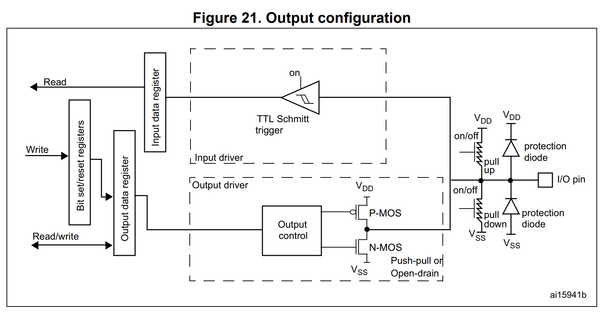
* **Write / Read/write 화살표 (맨 왼쪽)**: CPU나 코드가 레지스터에 접근하는 경로입니다.
* **Output data register ($GPIOx\_ODR$)**: 소프트웨어가 출력하고자 하는 디지털 값(0 또는 1)을 저장하는 장소입니다.
* **Bit set/reset registers ($GPIOx\_BSRR$)**: $ODR$ 레지스터의 특정 비트만 안전하게 1로 세트하거나 0으로 리셋해 주는 레지스터입니다.
* **Output driver (하단 점선 상자)**
  * **Output control**: 푸시풀(Push-pull) 또는 오픈 드레인(Open-drain) 모드 설정에 따라 P-MOS와 N-MOS 트랜지스터 스위치를 조종합니다.
  * **P-MOS / N-MOS**: 전기를 3.3V($V_{DD}$)로 밀어내거나(Push), 0V($V_{SS}$, GND)로 끌어당기는(Pull) 전자 스위치입니다.
* **Input driver (상단 점선 상자)**
  * **TTL Schmitt trigger**: 출력 모드일 때도 활성화되어 있어, 실제 핀에 걸린 전압을 실시간으로 읽어 $GPIOx\_IDR$(Input data register)로 넘겨줍니다.
  * **Pull-up / Pull-down 저항**: 필요한 경우 내부 저항을 켜고 끌 수 있습니다.
* **Protection Diode (보호 다이오드)**: 외부 정전기나 이상 전압으로부터 핀을 보호합니다.
* **I/O pin (맨 오른쪽)**: 보드 외부로 나와 있는 실제 물리 핀입니다.

#### 예시: PA5 핀에 LED 연결하기
> 회로 연결: PA5 핀 $\rightarrow$ 저항 $\rightarrow$ LED (+) 다리 $\rightarrow$ LED (-) 다리 $\rightarrow$ GND($V_{SS}$)
1. [상황 1] Push-Pull 모드로 LED 켜기 / 끄기
   * A. LED 켜기 (소프트웨어에서 '1' 출력)
     1. 코드 실행: HAL_GPIO_WritePin(GPIOA, GPIO_PIN_5, GPIO_PIN_SET) 또는 레지스터에 1 작성.
     2. 신호 전달: $BSRR$을 거쳐 Output data register($ODR$)의 5번 비트에 1이 저장됩니다.
     3. Output driver 동작: Output control이 상단 P-MOS 트랜지스터를 ON, 하단 N-MOS 트랜지스터를 OFF 시킵니다.
     4. 전류 흐름: $V_{DD}$(3.3V) 전원이 P-MOS를 타고 I/O pin으로 3.3V 전압을 밀어냅니다(Push).
     5. 외부 동작: 핀에서 나온 전류가 외부 저항과 LED를 거쳐 GND로 흘러 들어가며 LED에 불이 들어옵니다.
   * B. LED 끄기 (소프트웨어에서 '0' 출력)
     1. 코드 실행: HAL_GPIO_WritePin(GPIOA, GPIO_PIN_5, GPIO_PIN_RESET) 또는 레지스터에 0 작성.
     2. 신호 전달: Output data register($ODR$)의 5번 비트에 0이 저장됩니다.
     3. Output driver 동작: Output control이 상단 P-MOS를 OFF, 하단 N-MOS 트랜지스터를 ON 시킵니다.
     4. 전류 흐름: I/O pin이 $V_{SS}$(GND, 0V)와 연결되면서 핀 전압이 0V로 끌려 내려갑니다(Pull).
     5. 외부 동작: LED 양단 전압차가 없어지므로 전류가 흐르지 않고 LED가 꺼집니다.

2. [상황 2] Open-Drain 모드로 동작 시 (I2C 통신 등)
   * A. 기본 동작 특성
     1. 오픈 드레인 모드로 설정하면 P-MOS 트랜지스터는 절대 켜지지 않도록 차단됩니다.
   * B. 논리 상태별 동작
     1. '0'을 쓸 때: N-MOS만 ON되어 핀을 0V(GND)로 강하게 끌어내립니다 (Low).
     2. '1'을 쓸 때: N-MOS도 OFF되어 핀이 어디에도 연결되지 않은 공중에 떠 있는 Hi-Z(High-Impedance) 상태가 됩니다.
   * C. 결과 및 활용
     1. 스스로 3.3V를 내보내지 못하므로, 반드시 외부에 풀업 저항(Pull-up Resistor)을 달아주어야 1일 때 3.3V 전압이 형성됩니다. (I2C 통신선 등에서 신호 충돌 방지를 위해 사용)

3. [상황 3] 출력 모드에서 핀 상태 다시 읽기 (피드백 검사)
    1. MCU가 PA5 핀으로 3.3V(High)를 내보내는 중입니다.
    1. 이 신호는 핀을 타고 외부로 나감과 동시에, 상단 TTL Schmitt trigger 회로를 통과해 Input data register($IDR$)로 들어갑니다.
    1. 실무 활용: 만약 외부에서 핀이 쇼트(Short)되어 0V로 강하게 끌려 내려갔다면, 소프트웨어가 $ODR$(출력 지시값)은 1이지만 $IDR$(실제 핀 전압)은 0임을 읽어내어 "출력 단선 또는 쇼트 고장이 발생했다"는 것을 진단할 수 있습니다.

## Alternate function
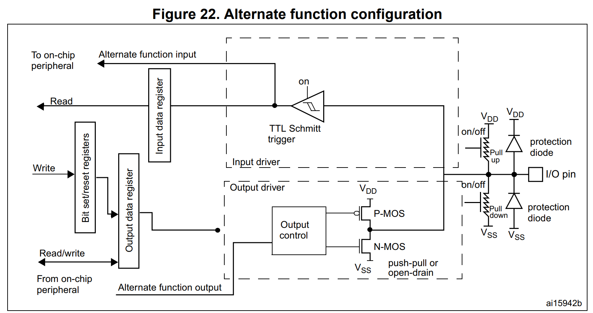
> Alternate function configuration (대체 기능 설정)  
I/O 포트가 대체 기능(Alternate function)으로 프로그래밍되었을 때:

* 출력 버퍼는 오픈 드레인(open-drain) 또는 푸시풀(push-pull)로 설정할 수 있습니다.
    * 일반 Output 모드와의 차이점:
        * 일반 출력 모드에서는 CPU가 GPIOx_ODR 레지스터에 쓰거나 GPIOx_BSRR을 조작하여 핀 전압을 바꿉니다.
        * Alternate Function 모드에서는 핀의 제어권이 주변장치(USART TX, SPI MOSI, Timer PWM 등) 내부 하드웨어 로직으로 넘어갑니다.
    * 작동 방식: 주변장치가 송신을 활성화(Transmitter Enable)하고 데이터를 보낼 때, 주변장치 내부의 직렬/디지털 데이터 신호가 직접 Output Driver를 드라이브하여 핀으로 전송됩니다.
* 출력 버퍼는 주변장치(Peripheral)로부터 들어오는 신호(송신 활성화 신호 및 데이터)에 의해 제어됩니다.
    * Output Type (OTYPER 레지스터):
        * Push-pull: UART TX, SPI Clock/MOSI 등 빠른 신호 전환과 명확한 High/Low 출력이 필요할 때 사용합니다.
        * Open-drain: I2C 통신(SDA/SCL)과 같이 버스 라인을 여러 장치가 공유하거나 외부 풀업 저항을 사용하는 통신 방식에 필수적입니다.
    * Pull-up / Pull-down (PUPDR 레지스터):
        * 대체 기능을 사용할 때도 라인의 부유(Floating) 방지나 통신 규격(예: I2C 내부 풀업 설정 필요 시)에 맞춰 internal pull-up/down을 유연하게 결합할 수 있습니다.
* 슈미트 트리거(Schmitt trigger) 입력이 활성화됩니다.
    * 입력 라인 오픈: 핀을 대체 기능 '출력'으로 사용할 때도 내부 입력 경로(Schmitt Trigger 및 Input Data Register)는 닫히지 않고 계속 동작합니다.
* GPIOx_PUPDR 레지스터의 설정값에 따라 약한 풀업(Pull-up) 및 풀다운(Pull-down) 저항이 활성화되거나 비활성화됩니다.
* I/O 핀에 존재하는 데이터는 매 AHB1 클록 주기마다 입력 데이터 레지스터(GPIOx_IDR)로 샘플링됩니다.
    * 입력 샘플링: 매 AHB1 버스 클록마다 핀의 실제 전압 상태가 GPIOx_IDR 레지스터로 자동 업데이트됩니다.
* 입력 데이터 레지스터에 읽기 접근을 하면 현재 I/O 핀의 상태(전압 논리 값)를 얻습니다.

| 구분 항목 | 일반 입력 모드 (Input) | 일반 출력 모드 (Output) | 대체 기능 모드 (Alternate Function) |
| :--- | :--- | :--- | :--- |
| **MODER 레지스터 설정** | `00` (Input mode) | `01` (General purpose output) | `10` (Alternate function mode) |
| **출력 버퍼 (Output Driver)** | 비활성화 (Disabled, Hi-Z) | 활성화 (Enabled) | 활성화 (Enabled) |
| **출력 제어 주체** | 없음 (출력 불가) | **CPU / S/W** (`GPIOx_ODR`, `BSRR`) | **내부 주변장치 (Peripheral)** (USART, SPI, Timer 등) |
| **출력 형태 설정 (OTYPER)** | 적용 안 됨 | Push-Pull 또는 Open-Drain | Push-Pull 또는 Open-Drain |
| **입력 버퍼 (Schmitt Trigger)** | **활성화 (Enabled)** | **활성화 (Enabled)** | **활성화 (Enabled)** |
| **입력 데이터 경로** | I/O Pin $\rightarrow$ Schmitt Trigger $\rightarrow$ `GPIOx_IDR` | I/O Pin $\rightarrow$ Schmitt Trigger $\rightarrow$ `GPIOx_IDR` | I/O Pin $\rightarrow$ Schmitt Trigger $\rightarrow$ `GPIOx_IDR` & **주변장치 입력 라인** |
| **내부 저항 (PUPDR)** | Pull-Up / Pull-Down / None 설정 가능 | Pull-Up / Pull-Down / None 설정 가능 | Pull-Up / Pull-Down / None 설정 가능 |
| **AF 레지스터 (`AFRL` / `AFRH`)** | 사용 안 함 | 사용 안 함 | **필수 설정** (AF0 ~ AF15 선택) |
| **주요 용도** | 스위치 입력, 센서 디지털 신호 읽기 | LED 제어, 릴레이 제어, 스위칭 신호 | UART TX/RX, SPI MOSI/MISO/SCK, I2C SDA/SCL, Timer PWM/Capture |

## Analog configuration
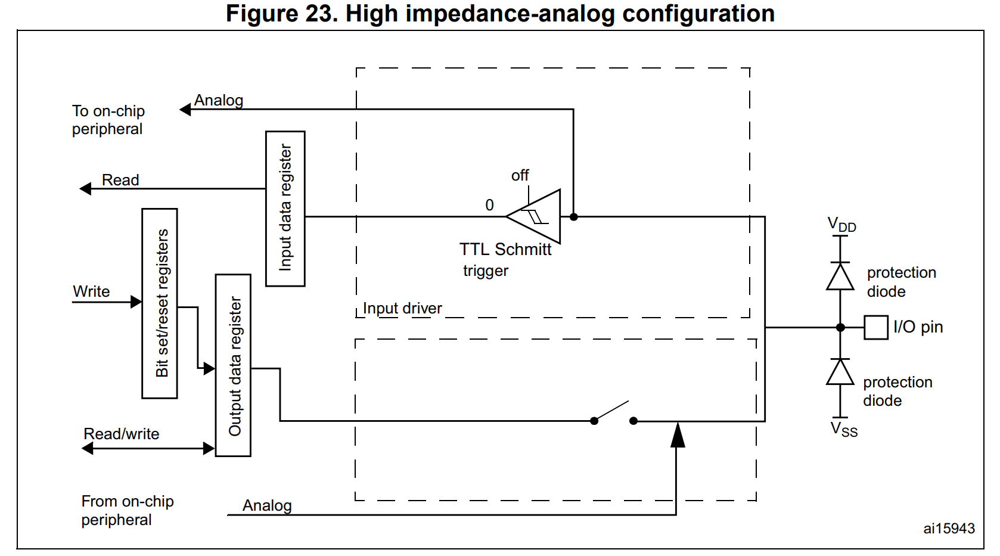

> Analog configuration (아날로그 설정)  
I/O 포트가 아날로그 설정으로 프로그래밍되었을 때:

- 출력 버퍼가 비활성화됩니다.
    * 원인/동작: P-MOS/N-MOS 출력 드라이버와 내부 풀업/풀다운 저항이 모두 꺼집니다.
    * 이유: 외부에 연결된 미세한 아날로그 신호(예: 센서 전압)가 내부 저항이나 출력 트랜지스터에 의해 왜곡(노이즈 발생, 전압 강하 등)되는 것을 방지하여 원본 신호 그대로 ADC/DAC 모듈로 전달하기 위함입니다.
- 슈미트 트리거 입력이 비활성화되어, I/O 핀에 어떠한 아날로그 전압이 들어오더라도 소비 전력이 0이 됩니다. 슈미트 트리거의 출력값은 항상 고정된 값(0)으로 유지됩니다.
    * 디지털 입력과의 차이: 디지털 모드에서는 중간 전압(예: $1.6\text{V}$)이 들어오면 슈미트 트리거 내부 트랜지스터가 불완전하게 켜져 관통 전류(Through current)가 흐르고 전력이 소모됩니다.
    * 아날로그 모드의 이점: 아날로그 모드에서는 슈미트 트리거 자체를 끄기 때문에 핀에 $0\text{V} \sim 3.3\text{V}$ 사이의 어떤 전압이 인가되어도 누설 전류 및 누적 전력 소모가 전혀 발생하지 않습니다.
    * 결과: 슈미트 트리거 출력이 '0'으로 고정되므로, 디지털 입력 데이터 레지스터(GPIOx_IDR)를 읽어보아도 실제 아날로그 전압과 상관없이 항상 0이 읽힙니다.
- 내부 풀업 및 풀다운 저항이 비활성화됩니다.
- 입력 데이터 레지스터에 읽기 접근을 하면 항상 "0"을 반환합니다.
- 주의: 아날로그 설정에서는 I/O 핀이 5V 허용 상태를 유지할 수 없습니다.
    * STM32의 많은 GPIO 핀은 디지털 입력 모드일 때 $5\text{V}$ 신호를 직접 입력받을 수 있는 FT(5V Tolerant) 특성을 가집니다.
    * 하지만 MODER 레지스터를 Analog(11)로 설정하는 순간 보호 회로 구조상 5V 내성 기능이 해제됩니다.
    * 따라서 아날로그 모드로 설정된 핀에는 절대 MCU 동작 전압($V_{DD}$, 보통 $3.3\text{V}$)을 초과하는 전압을 인가해서는 안 되며, 과전압 인가 시 칩이 파손될 수 있습니다.

| 항목 | 일반 입력/출력 모드 | 아날로그(Analog) 모드 |
| :--- | :--- | :--- |
| **주된 용도** | 디지털 High/Low 신호 제어 | ADC 센서 입력, DAC 출력, 저전력 모드 |
| **슈미트 트리거** | 활성화 (디지털 0/1 판단) | 비활성화 (전력 소모 0) |
| **GPIOx_IDR 읽기** | 현재 핀의 디지털 상태 (0 or 1) | 항상 0 반환 |
| **5V Tolerant** | 지원 (해당 핀에 한함) | 미지원 (최대 $V_{DD}$까지만 가능) |


## 핵!심 레지스터
* 입/출력
    * MODER (Port Mode Register): 핀의 방향 및 모드 설정
* 입력
    * PUPDR (Pull-up/Pull-down Register): 입력 내부 저항 설정 (00: None, 01: Pull-up, 10: Pull-down)
    * IDR (Input Data Register): 핀의 현재 입력 상태를 읽는 Read-only 레지스터
* 출력
    * OTYPER (Output Type Register): 출력 유형 설정 (0: Push-Pull, 1: Open-Drain)
    * ODR (Output Data Register): 핀의 출력 상태를 제어하는 Read/Write 레지스터

***
## 레지스터 구조 읽기
### 레지스터 구조 읽기
[reference_menual]185 : 7.4 GPIO registers
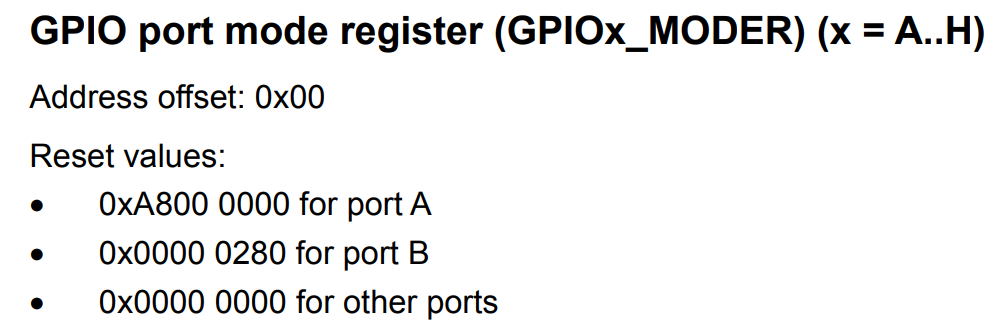
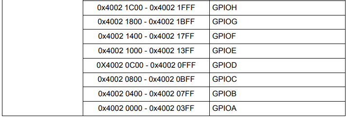


**GPIOx_MODER (Address offset: 0x00)**
* 해당 주변장치의 기본 주소(Base Address)에 Offset을 더한 값이 해당 레지스터의 실제 메모리 주소가 됩니다.
* $\text{GPIO A Base Address } (0\text{x4002 0000}) + \text{Offset } (0\text{x00}) = 0\text{x4002 0000}$

**Reset values**
* MCU가 리셋(전원 재인가 또는 Reset 버튼 누름) 직후 해당 레지스터에 기본적으로 들어있는 16진수(Hexadecimal) 값입니다.
* 초기화 코드를 추가로 작성하지 않아도 되는 상태인지 확인할 때 참고합니다.
* Port A : ${0xA800\ 0000} = \text{1010 1000 0000 0000 0000 0000 0000 0000}_2$
    * 최상위 비트들(PA13, PA14, PA15 등)이 10으로 설정되어 있습니다.
    * PA13, PA14, PA15 핀은 디버깅용 JTAG/SWD 핀으로 할당되어 리셋 직후 Alternate Function 모드(10)로 동작해야 디버거와 통신할 수 있기 때문입니다.
* Port A, Port B: 리셋 직후 디버거(ST-LINK 등)와 통신(JTAG/SWD)을 연결하기 위한 특수 핀들만 Alternate Function(10)으로 세팅되어 있어서 리셋 값이 특이한 형태(0xA800 0000, 0x0000 0280)를 가집니다.


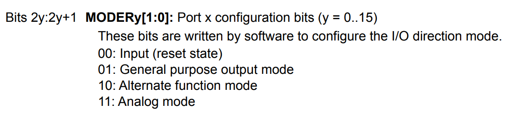


**Access Type (접근 권한 / Access)**

* rw (Read/Write): 읽기와 쓰기
* r (Read-only): 읽기. 쓰기를 수행해도 영향이 없거나 무시됩니다.
* w (Write-only): 쓰기. 읽었을 때 의미 없는 값이 나오거나 레지스터 특성에 따라 처리됩니다.
* w1 / rc_w1 / rc_w0 등 (특수 접근): * w1: 1을 쓸 때만 동작 수행 (예: GPIOx_BSRR 세트/리셋 동작).
    * rc_w1 (Read/Clear by writing 1): 인터럽트 플래그 등에서 많이 쓰이며, 비트를 읽은 후 1을 쓰면 해당 비트가 0으로 클리어됩니다.


**

**핀 번호와 비트 위치의 관계**
* y: 해당 포트의 핀 번호(Pin 0 ~ Pin 15)를 의미합니다.
* MODERy[1:0]: 핀 y 하나당 2개 비트를 묶어서 제어한다는 뜻입니다.
    * 컴퓨터 분야에서는 비트 범위를 나타낼 때 항상 [상위 비트 : 하위 비트] 순서로 적는 것이 국제 표준 표기법입니다.
* Bits 2y:2y+1: 핀 번호 $y$에 대응하는 레지스터 비트의 위치를 구하는 수학 공식입니다.

**2비트 조합에 따른 동작 모드 설정**
* 2개 비트 조합($2^2 = 4$가지)에 따라 하드웨어 핀의 동작이 결정됩니다.
1. 00 (Input): 외부 디지털 신호를 읽어오는 입력 모드 (기본 값)
1. 01 (General purpose output): LED, 리레이 등을 제어하는 일반 디지털 출력 모드
1. 10 (Alternate function): UART, SPI, I2C, PWM 타이머 등 내부 주변장치 전용 핀으로 연결
1. 11 (Analog): ADC 입력 또는 DAC 출력 등 아날로그 전압 신호용 모드 (디지털 슈미트 트리거 OFF)

**


**비트 지정 방식**
* 단일 비트 (Bit N): 온/오프(Enable/Disable, Set/Reset) 스위치 역할을 합니다.
    * Bit 16 LCKK $\rightarrow$ 16번 비트 1개로 제어.   
* 범위 비트 (Bits [M:N]): 여러 비트를 묶어 다수의 옵션 선택에 사용합니다.
    * MODERy[1:0] (y = 0..15) $\rightarrow$ 핀 하나당 2비트씩 할당되어 총 4가지 모드 중 하나를 선택.


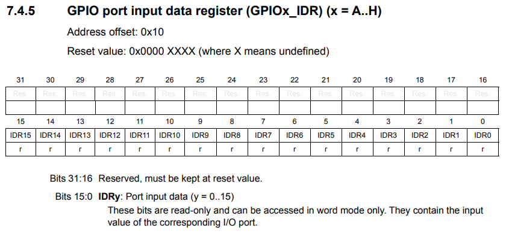

MODER_register 는 핀당 bit가 2개씩 : 범위 비트 `Bits 2y:2y+1 MODERy[1:0]`  
IDR_register 는 핀당 bit가 1개 : 단일 비트 `IDRy`


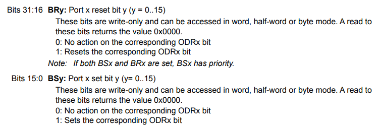  
검처럼 레지스터도 쪼개면 아무튼 두배 빠른덧..?

**

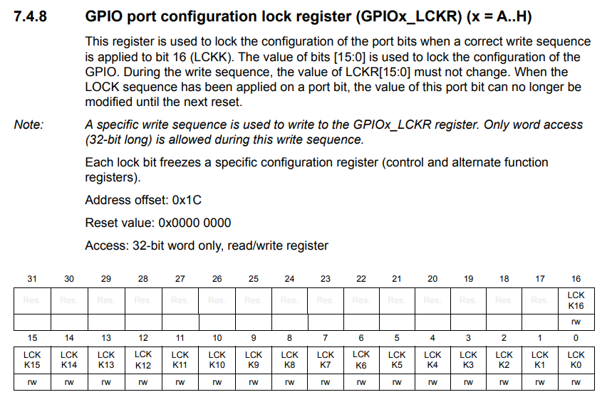    
Access : 32bit word only


* 32-bit Word Access 필수: 
    * 아무런 의도치 않은 쓰기 작업으로 실수로 핀이 잠기는 것을 방지하기 위해, ST사 MCU는 엄격한 32비트 워드(Word) 쓰기/읽기 시퀀스를 요구합니다.
    * LCKK(Bit 16)와 LCK[15:0](Bit 15~0)을 동시에 제어해야 하므로 반드시 32비트 단편(Word) 단위로 접근해야 합니다. (8비트/16비트 접근 불가)

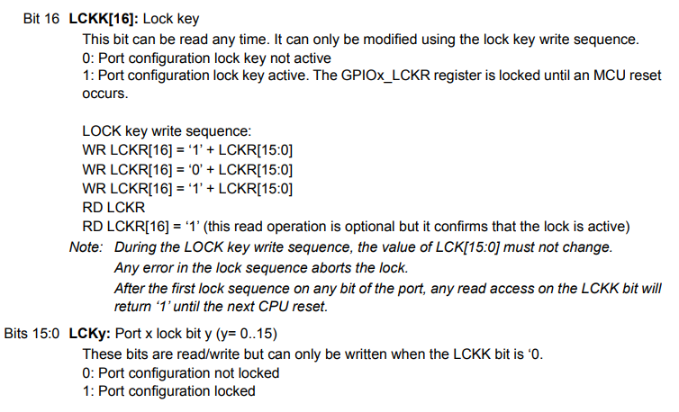  

* GPIOx_LCKR은 32비트 레지스터입니다.
    * LCKK (Bit 16): Lock Key 비트. 특정 시퀀스를 통해 잠금 상태를 활성화/확인하는 비트입니다.
        * 0: Lock 미활성화
        * 1: Lock 활성화됨 (한 번 1이 되면 MCU 리셋 전까지 0으로 돌아가지 않음)
        * 정해진 특수 순서(Sequence)대로 레지스터에 데이터를 썼다 지웠다 해야만 잠금이 걸리도록 암호를 설계해 두었습니다.
        ```c
        WR LCKR[16] = ‘1’ + LCKR[15:0]  ──> 1단계: LCKK에 1을 쓰고, 잠글 핀(LCKy) 지정
        WR LCKR[16] = ‘0’ + LCKR[15:0]  ──> 2단계: LCKK만 0으로 바꾸고, 핀 지정은 그대로 유지
        WR LCKR[16] = ‘1’ + LCKR[15:0]  ──> 3단계: LCKK에 다시 1을 씀
        RD LCKR                         ──> 4단계: LCKR 레지스터를 아무 생각 없이 한 번 읽음 (하드웨어 트리거)
        RD LCKR[16] = ‘1’               ──> 5단계: LCKK 비트를 읽어서 '1'인지 확인 (선택 사항, 잠금 성공 여부 검증)
        ```
        * LCK[15:0] 값 유지: 시퀀스를 수행하는 도중 LCK[15:0] 비트 패턴(잠그고자 하는 핀 선택 값)은 항상 동일해야 합니다.
        * 순서도 틀리면 안됨.

    * LCK[15:0] (Bit 15 ~ Bit 0): 포트 내 Pin 0 ~ Pin 15에 각각 대응되는 비트입니다.
        * 0: 해당 핀의 설정을 잠그지 않음 (Unlocked)
        * 1: 해당 핀의 설정을 잠금 (Locked)
    
<br> **

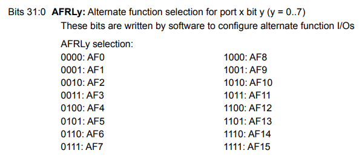  

pin당 4bit 8핀*4빗=32빗=1레지스터 그래서 2개 레지스터.

32개 비트 칸을 그려놓고 각 비트 칸마다 단일 비트 표기를 적음(같은 범위 비트인데 MODER이랑 좀 다르네?)

  

4개 비트를 묶어서 AFSEL0[3:0]이라고 표기해도 되지만, 

4비트 중 몇 번째 비트가 32비트 레지스터의 정확히 어느 위치(Bit position)에 들어가는지 보여주기 위해서.

<br>

**
tips
### 비트 연산
* 비트 켜기: S | (1 << n)
* 비트 끄기: S & ~(1 << n)
* 비트 토글: S ^ (1 << n)
* 비트 확인: (S & (1 << n)) != 0


***
## 음파음파

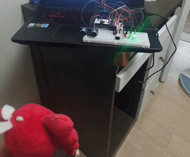


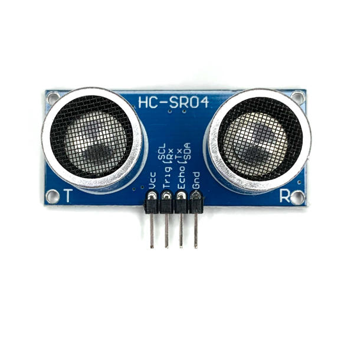

* VCC: 아두이노 5V 핀에 연결
* TRIG: 아두이노 디지털 핀(예: 9번)에 연결 > 여기로 신호가 가면 초음파 발사
* ECHO: 아두이노 디지털 핀(예: 8번)에 연결 > 반사된 초음파 받아서 입력
* GND: 아두이노 GND 핀에 연결

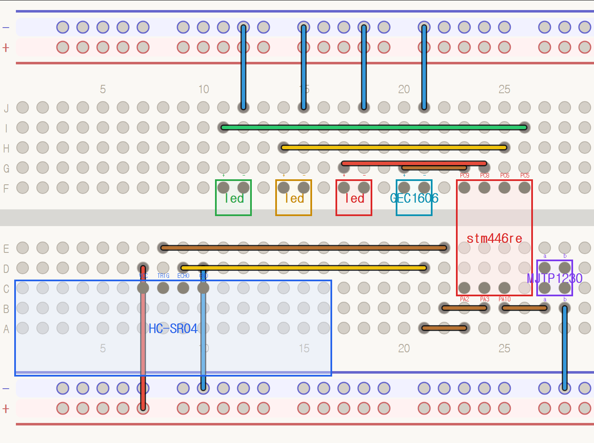

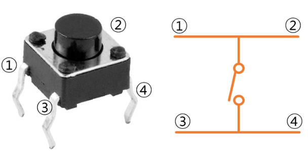

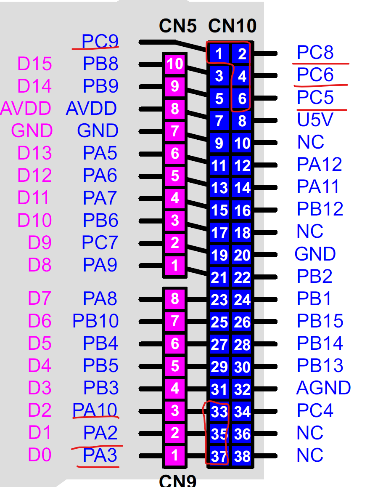

회로도 참고 !

led에는 저항이 꼭 있어야해요.

**

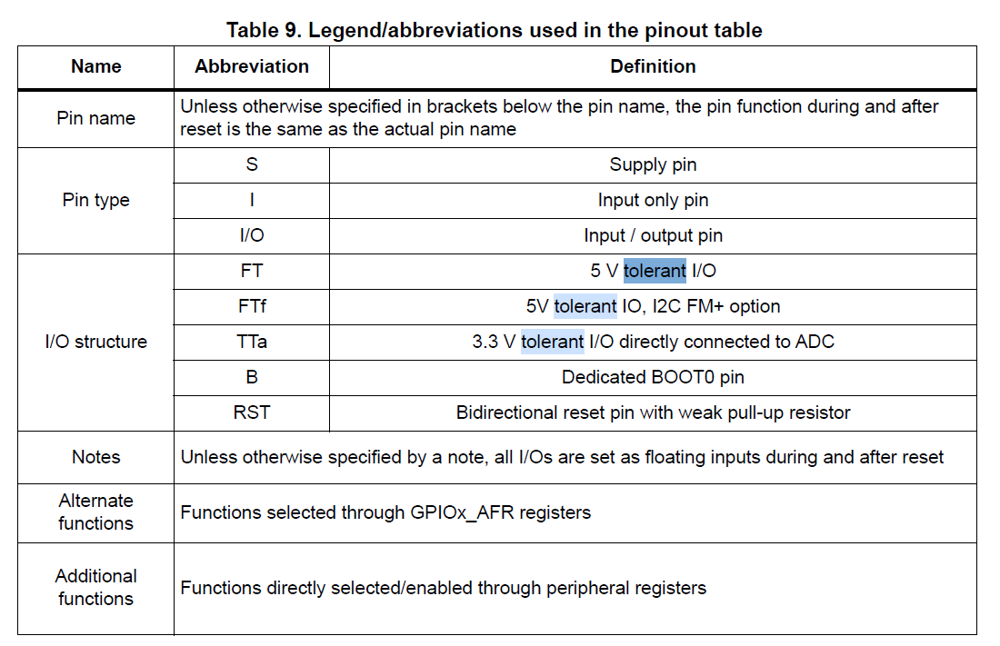


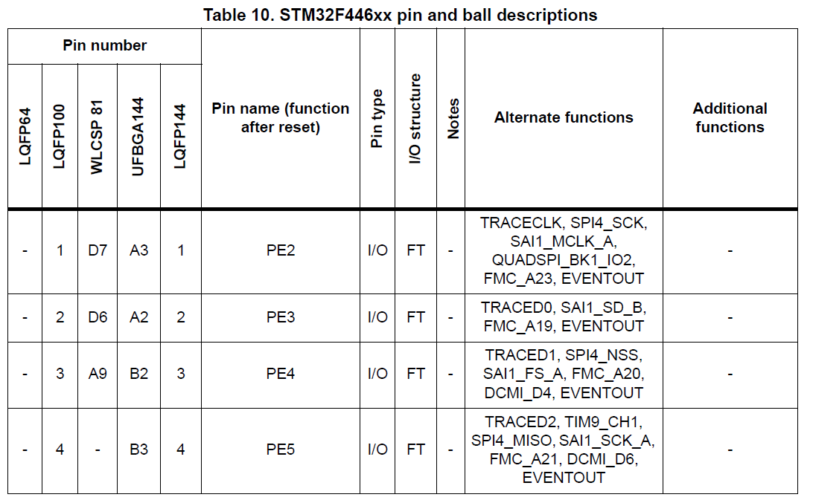


datasheet를 살펴보면 5v입력 받아도 괜찮은 핀과 그렇지 않은 핀이 있다.
다행이 GPIO 핀들은 전부 ok


```md
버튼을 누르기 전에는

초음파 센서는 작동하지 않습니다.

LED는 빛을 내지 않습니다.


버튼을 눌러서 작동시킵니다.

초음파 센서가 감지한 거리별로 각 다이오드에 불이 켜집니다.

0~9cm : red 다이오드(PC8) 그리고 부저 GEC1606이 작동합니다. 나머지 다이오드는 작동하지 않습니다.

10~19cm : yellow 다이오드 PC6이 켜집니다. 나머지 다이오드와 부저는 작동하지 않습니다.

20cm~ : green 다이오드 PC5가 켜집니다. 나머지 다이오드와 부저는 작동하지 않습니다.


버튼을 다시 누르면

초음파 센서는 작동하지 않습니다.

LED는 빛을 내지 않습니다. 


```

1. STM32CubeMX 핀 설정 안내
    * 코드 작성 전 CubeMX에서 아래와 같이 핀 설정을 구성해 주세요.
        1. GPIO Output 설정:
            * PA5: GPIO_Output 설정 (Label: LD2)
            * PA9: GPIO_Output 설정 (Label: TRIG)
            * PC5 : GPIO_Output (초록 LED)
            * PC6 : GPIO_Output (노란 LED)
            * PC8 : GPIO_Output (빨간 LED)
            * PC9 : GPIO_Output (부저)
        1. GPIO Input 설정:
            * PA8: GPIO_Input 설정 (Label: ECHO)
            * PB10: GPIO_Input 설정, `Pull-up`으로 변경 (Label: BTN_TOGGLE)
1. Timer 설정 (마이크로초(µs) 단위 시간 측정용)
    * HC-SR04는 펄스 지속 시간을 microsecond(µs) 단위로 측정해야 하므로 TIM2 타이머를 사용합니다.
        1. 좌측 메뉴 Categories -> Timers -> TIM2 선택
        1. Clock Source: Internal Clock 설정
        1. Parameter Settings:
        1. Prescaler (PSC): 16 - 1
            > (기본 HSI 내부 클록인 16MHz 기준, Prescaler를 16-1로 설정하면 타이머 카운터가 1µs마다 1씩 증가합니다. 만약 시스템 클록을 84MHz로 변경하셨다면 84 - 1로 설정하세요.)
```c
/* USER CODE BEGIN Header */
/**
  ******************************************************************************
  * @file           : main.c
  * @brief          : Main program body
  ******************************************************************************
  * @attention
  *
  * Copyright (c) 2026 STMicroelectronics.
  * All rights reserved.
  *
  * This software is licensed under terms that can be found in the LICENSE file
  * in the root directory of this software component.
  * If no LICENSE file comes with this software, it is provided AS-IS.
  *
  ******************************************************************************
  */
/* USER CODE END Header */
/* Includes ------------------------------------------------------------------*/
#include "main.h"

/* Private includes ----------------------------------------------------------*/
/* USER CODE BEGIN Includes */

/* USER CODE END Includes */

/* Private typedef -----------------------------------------------------------*/
/* USER CODE BEGIN PTD */

/* USER CODE END PTD */

/* Private define ------------------------------------------------------------*/
/* USER CODE BEGIN PD */

/* USER CODE END PD */

/* Private macro -------------------------------------------------------------*/

/* USER CODE BEGIN PM */

/* USER CODE END PM */

/* Private variables ---------------------------------------------------------*/

TIM_HandleTypeDef htim2;

/* USER CODE BEGIN PV */
uint32_t pMillis;
uint32_t val1 = 0;
uint32_t val2 = 0;
uint16_t echo_time = 0;
uint8_t distance_cm = 0;

uint8_t sensor_enable = 0; // 0: 센서 OFF / 1: 센서 ON (토글 플래그)

// 마이크로초(us) 단위 지연 함수
void delay_us (uint16_t us)
{
    __HAL_TIM_SET_COUNTER(&htim2, 0);
    while (__HAL_TIM_GET_COUNTER(&htim2) < us);
}

/* USER CODE END PV */

/* Private function prototypes -----------------------------------------------*/
void SystemClock_Config(void);
static void MX_GPIO_Init(void);
static void MX_TIM2_Init(void);
/* USER CODE BEGIN PFP */

/* USER CODE END PFP */

/* Private user code ---------------------------------------------------------*/
/* USER CODE BEGIN 0 */

/* USER CODE END 0 */

/**
  * @brief  The application entry point.
  * @retval int
  */
int main(void)
{

  /* USER CODE BEGIN 1 */

  /* USER CODE END 1 */

  /* MCU Configuration--------------------------------------------------------*/

  /* Reset of all peripherals, Initializes the Flash interface and the Systick. */
  HAL_Init();

  /* USER CODE BEGIN Init */

  /* USER CODE END Init */

  /* Configure the system clock */
  SystemClock_Config();

  /* USER CODE BEGIN SysInit */

  /* USER CODE END SysInit */

  /* Initialize all configured peripherals */
  MX_GPIO_Init();
  MX_TIM2_Init();
  /* USER CODE BEGIN 2 */
  HAL_TIM_Base_Start(&htim2); // TIM2 타이머 시작
  /* USER CODE END 2 */

  /* Initialize leds */
  BSP_LED_Init(LED2);

  /* Initialize USER push-button, will be used to trigger an interrupt each time it's pressed.*/
  BSP_PB_Init(BUTTON_USER, BUTTON_MODE_EXTI);

  /* Infinite loop */
  /* USER CODE BEGIN WHILE */
  while (1)
    {
        // ----------------------------------------------------
        // 1. 버튼 입력 처리 (토글 및 스위치 채터링 방지)
        // ----------------------------------------------------
        // Pull-up 설정이므로 버튼을 누르면 LOW(RESET) 상태가 됨
        if (HAL_GPIO_ReadPin(GPIOB, GPIO_PIN_10) == GPIO_PIN_RESET)
        {
            HAL_Delay(50); // 버튼 접점 진동(채터링) 방지용 지연

            // 지연 후에도 여전히 눌려있다면 진짜 누른 것으로 인정
            if (HAL_GPIO_ReadPin(GPIOB, GPIO_PIN_10) == GPIO_PIN_RESET)
            {
                sensor_enable = !sensor_enable; // ON/OFF 상태 반전 (0 -> 1 -> 0)

                // 버튼에서 손을 뗄 때까지 대기 (꾹 누르고 있어도 1번만 토글되도록)
                while (HAL_GPIO_ReadPin(GPIOB, GPIO_PIN_10) == GPIO_PIN_RESET);
            }
        }

        // ----------------------------------------------------
	  // 2. 센서 동작 상태에 따른 처리
	  // ----------------------------------------------------
	  if (sensor_enable == 1)
	  {
		  // --- 초음파 측정 시작 ---
		  HAL_GPIO_WritePin(GPIOA, GPIO_PIN_5, GPIO_PIN_SET);

		  HAL_GPIO_WritePin(GPIOA, GPIO_PIN_9, GPIO_PIN_RESET);
		  delay_us(2);
		  HAL_GPIO_WritePin(GPIOA, GPIO_PIN_9, GPIO_PIN_SET);
		  delay_us(10);
		  HAL_GPIO_WritePin(GPIOA, GPIO_PIN_9, GPIO_PIN_RESET);

		  pMillis = HAL_GetTick();
		  while (!(HAL_GPIO_ReadPin(GPIOA, GPIO_PIN_8)) && (HAL_GetTick() - pMillis < 10));
		  val1 = __HAL_TIM_GET_COUNTER(&htim2);

		  pMillis = HAL_GetTick();
		  while ((HAL_GPIO_ReadPin(GPIOA, GPIO_PIN_8)) && (HAL_GetTick() - pMillis < 10));
		  val2 = __HAL_TIM_GET_COUNTER(&htim2);

		  if (val2 >= val1)
		  {
			  echo_time = val2 - val1;
		  }
		  else
		  {
			  echo_time = (65535 - val1) + val2;
		  }

		  distance_cm = echo_time / 58;

		  // ----------------------------------------------------
		  // 3. 거리 구간별 외부 LED 제어 로직
		  // ----------------------------------------------------
		  if (distance_cm > 0 && distance_cm <= 9)
		  {
			  // [0~9cm] 빨간 LED 2개(PC8, PC9) ON / 나머지 OFF
			  HAL_GPIO_WritePin(GPIOC, GPIO_PIN_8 | GPIO_PIN_9, GPIO_PIN_SET);
			  HAL_GPIO_WritePin(GPIOC, GPIO_PIN_6, GPIO_PIN_RESET);
			  HAL_GPIO_WritePin(GPIOC, GPIO_PIN_5, GPIO_PIN_RESET);
		  }
		  else if (distance_cm >= 10 && distance_cm <= 19)
		  {
			  // [10~19cm] 노란 LED(PC6) ON / 나머지 OFF
			  HAL_GPIO_WritePin(GPIOC, GPIO_PIN_8 | GPIO_PIN_9, GPIO_PIN_RESET);
			  HAL_GPIO_WritePin(GPIOC, GPIO_PIN_6, GPIO_PIN_SET);
			  HAL_GPIO_WritePin(GPIOC, GPIO_PIN_5, GPIO_PIN_RESET);
		  }
		  else if (distance_cm >= 20)
		  {
			  // [20cm 이상] 초록 LED(PC5) ON / 나머지 OFF
			  HAL_GPIO_WritePin(GPIOC, GPIO_PIN_8 | GPIO_PIN_9, GPIO_PIN_RESET);
			  HAL_GPIO_WritePin(GPIOC, GPIO_PIN_6, GPIO_PIN_RESET);
			  HAL_GPIO_WritePin(GPIOC, GPIO_PIN_5, GPIO_PIN_SET);
		  }
		  else
		  {
			  // 측정 오류(0cm 이하) 발생 시 모든 외부 LED OFF
			  HAL_GPIO_WritePin(GPIOC, GPIO_PIN_5 | GPIO_PIN_6 | GPIO_PIN_8 | GPIO_PIN_9, GPIO_PIN_RESET);
		  }
	  }
	  else
	  {
		  // --- 센서 OFF 상태일 때: 모든 외부/온보드 LED 꺼짐 ---
		  HAL_GPIO_WritePin(GPIOC, GPIO_PIN_5 | GPIO_PIN_6 | GPIO_PIN_8 | GPIO_PIN_9, GPIO_PIN_RESET);
		  HAL_GPIO_WritePin(GPIOA, GPIO_PIN_5, GPIO_PIN_RESET); // LD2 OFF
	  }

	  HAL_Delay(50); // 루프 주기를 조금 줄여 버튼 반응성을 높임
    /* USER CODE END WHILE */

    /* USER CODE BEGIN 3 */
    }
  /* USER CODE END 3 */
}

/**
  * @brief System Clock Configuration
  * @retval None
  */
void SystemClock_Config(void)
{
  RCC_OscInitTypeDef RCC_OscInitStruct = {0};
  RCC_ClkInitTypeDef RCC_ClkInitStruct = {0};

  /** Configure the main internal regulator output voltage
  */
  __HAL_RCC_PWR_CLK_ENABLE();
  __HAL_PWR_VOLTAGESCALING_CONFIG(PWR_REGULATOR_VOLTAGE_SCALE3);

  /** Initializes the RCC Oscillators according to the specified parameters
  * in the RCC_OscInitTypeDef structure.
  */
  RCC_OscInitStruct.OscillatorType = RCC_OSCILLATORTYPE_HSI;
  RCC_OscInitStruct.HSIState = RCC_HSI_ON;
  RCC_OscInitStruct.HSICalibrationValue = RCC_HSICALIBRATION_DEFAULT;
  RCC_OscInitStruct.PLL.PLLState = RCC_PLL_ON;
  RCC_OscInitStruct.PLL.PLLSource = RCC_PLLSOURCE_HSI;
  RCC_OscInitStruct.PLL.PLLM = 16;
  RCC_OscInitStruct.PLL.PLLN = 336;
  RCC_OscInitStruct.PLL.PLLP = RCC_PLLP_DIV4;
  RCC_OscInitStruct.PLL.PLLQ = 2;
  RCC_OscInitStruct.PLL.PLLR = 2;
  if (HAL_RCC_OscConfig(&RCC_OscInitStruct) != HAL_OK)
  {
    Error_Handler();
  }

  /** Initializes the CPU, AHB and APB buses clocks
  */
  RCC_ClkInitStruct.ClockType = RCC_CLOCKTYPE_HCLK|RCC_CLOCKTYPE_SYSCLK
                              |RCC_CLOCKTYPE_PCLK1|RCC_CLOCKTYPE_PCLK2;
  RCC_ClkInitStruct.SYSCLKSource = RCC_SYSCLKSOURCE_PLLCLK;
  RCC_ClkInitStruct.AHBCLKDivider = RCC_SYSCLK_DIV1;
  RCC_ClkInitStruct.APB1CLKDivider = RCC_HCLK_DIV2;
  RCC_ClkInitStruct.APB2CLKDivider = RCC_HCLK_DIV1;

  if (HAL_RCC_ClockConfig(&RCC_ClkInitStruct, FLASH_LATENCY_2) != HAL_OK)
  {
    Error_Handler();
  }
}

/**
  * @brief TIM2 Initialization Function
  * @param None
  * @retval None
  */
static void MX_TIM2_Init(void)
{

  /* USER CODE BEGIN TIM2_Init 0 */

  /* USER CODE END TIM2_Init 0 */

  TIM_ClockConfigTypeDef sClockSourceConfig = {0};
  TIM_MasterConfigTypeDef sMasterConfig = {0};

  /* USER CODE BEGIN TIM2_Init 1 */

  /* USER CODE END TIM2_Init 1 */
  htim2.Instance = TIM2;
  htim2.Init.Prescaler = 83;
  htim2.Init.CounterMode = TIM_COUNTERMODE_UP;
  htim2.Init.Period = 4294967295;
  htim2.Init.ClockDivision = TIM_CLOCKDIVISION_DIV1;
  htim2.Init.AutoReloadPreload = TIM_AUTORELOAD_PRELOAD_DISABLE;
  if (HAL_TIM_Base_Init(&htim2) != HAL_OK)
  {
    Error_Handler();
  }
  sClockSourceConfig.ClockSource = TIM_CLOCKSOURCE_INTERNAL;
  if (HAL_TIM_ConfigClockSource(&htim2, &sClockSourceConfig) != HAL_OK)
  {
    Error_Handler();
  }
  sMasterConfig.MasterOutputTrigger = TIM_TRGO_RESET;
  sMasterConfig.MasterSlaveMode = TIM_MASTERSLAVEMODE_DISABLE;
  if (HAL_TIMEx_MasterConfigSynchronization(&htim2, &sMasterConfig) != HAL_OK)
  {
    Error_Handler();
  }
  /* USER CODE BEGIN TIM2_Init 2 */

  /* USER CODE END TIM2_Init 2 */

}

/**
  * @brief GPIO Initialization Function
  * @param None
  * @retval None
  */
static void MX_GPIO_Init(void)
{
  GPIO_InitTypeDef GPIO_InitStruct = {0};
  /* USER CODE BEGIN MX_GPIO_Init_1 */

  /* USER CODE END MX_GPIO_Init_1 */

  /* GPIO Ports Clock Enable */
  __HAL_RCC_GPIOC_CLK_ENABLE();
  __HAL_RCC_GPIOH_CLK_ENABLE();
  __HAL_RCC_GPIOA_CLK_ENABLE();
  __HAL_RCC_GPIOB_CLK_ENABLE();

  /*Configure GPIO pin Output Level */
  HAL_GPIO_WritePin(GPIOC, GPIO_PIN_5|GPIO_PIN_6|GPIO_PIN_8|GPIO_PIN_9, GPIO_PIN_RESET);

  /*Configure GPIO pin Output Level */
  HAL_GPIO_WritePin(TRIG_GPIO_Port, TRIG_Pin, GPIO_PIN_RESET);

  /*Configure GPIO pins : USART_TX_Pin USART_RX_Pin */
  GPIO_InitStruct.Pin = USART_TX_Pin|USART_RX_Pin;
  GPIO_InitStruct.Mode = GPIO_MODE_AF_PP;
  GPIO_InitStruct.Pull = GPIO_NOPULL;
  GPIO_InitStruct.Speed = GPIO_SPEED_FREQ_VERY_HIGH;
  GPIO_InitStruct.Alternate = GPIO_AF7_USART2;
  HAL_GPIO_Init(GPIOA, &GPIO_InitStruct);

  /*Configure GPIO pins : PC5 PC6 PC8 PC9 */
  GPIO_InitStruct.Pin = GPIO_PIN_5|GPIO_PIN_6|GPIO_PIN_8|GPIO_PIN_9;
  GPIO_InitStruct.Mode = GPIO_MODE_OUTPUT_PP;
  GPIO_InitStruct.Pull = GPIO_NOPULL;
  GPIO_InitStruct.Speed = GPIO_SPEED_FREQ_LOW;
  HAL_GPIO_Init(GPIOC, &GPIO_InitStruct);

  /*Configure GPIO pin : BTN_TOGGLE_Pin */
  GPIO_InitStruct.Pin = BTN_TOGGLE_Pin;
  GPIO_InitStruct.Mode = GPIO_MODE_INPUT;
  GPIO_InitStruct.Pull = GPIO_PULLUP;
  HAL_GPIO_Init(BTN_TOGGLE_GPIO_Port, &GPIO_InitStruct);

  /*Configure GPIO pin : ECHO_Pin */
  GPIO_InitStruct.Pin = ECHO_Pin;
  GPIO_InitStruct.Mode = GPIO_MODE_INPUT;
  GPIO_InitStruct.Pull = GPIO_NOPULL;
  HAL_GPIO_Init(ECHO_GPIO_Port, &GPIO_InitStruct);

  /*Configure GPIO pin : TRIG_Pin */
  GPIO_InitStruct.Pin = TRIG_Pin;
  GPIO_InitStruct.Mode = GPIO_MODE_OUTPUT_PP;
  GPIO_InitStruct.Pull = GPIO_NOPULL;
  GPIO_InitStruct.Speed = GPIO_SPEED_FREQ_LOW;
  HAL_GPIO_Init(TRIG_GPIO_Port, &GPIO_InitStruct);

  /* USER CODE BEGIN MX_GPIO_Init_2 */

  /* USER CODE END MX_GPIO_Init_2 */
}

/* USER CODE BEGIN 4 */

/* USER CODE END 4 */

/**
  * @brief  This function is executed in case of error occurrence.
  * @retval None
  */
void Error_Handler(void)
{
  /* USER CODE BEGIN Error_Handler_Debug */
  /* User can add his own implementation to report the HAL error return state */
  __disable_irq();
  while (1)
  {
  }
  /* USER CODE END Error_Handler_Debug */
}
#ifdef USE_FULL_ASSERT
/**
  * @brief  Reports the name of the source file and the source line number
  *         where the assert_param error has occurred.
  * @param  file: pointer to the source file name
  * @param  line: assert_param error line source number
  * @retval None
  */
void assert_failed(uint8_t *file, uint32_t line)
{
  /* USER CODE BEGIN 6 */
  /* User can add his own implementation to report the file name and line number,
     ex: printf("Wrong parameters value: file %s on line %d\r\n", file, line) */
  /* USER CODE END 6 */
}
#endif /* USE_FULL_ASSERT */

```